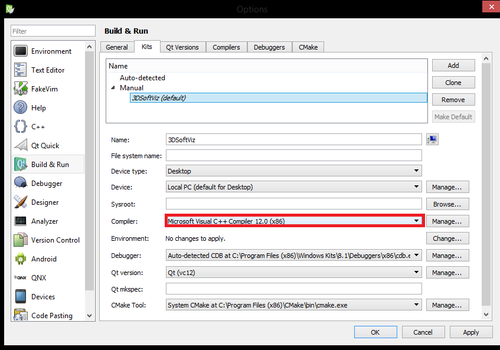

Migrácia na MSVC2013
====================

 1. **Nainštalujte si Microsoft Visual Studio 2013 (x86)**

Môžete použiť verziu z `MS DreamSpark <https://www.dreamspark.com/>`_. Testované na MS Visual Studio Ultimate 2013 a MS Visual Studio Pro 2013 bez updatov.

	.. note:: Nie Visual Studio Express!

 2. **Zálohujte staré súbory**

	*   OpenSceneGraph
	*   Qt (v ktorom sa má nachádzať aj váš QtCreator)

 3. **Umiestnite nové súbory namiesto starých (nič neprepisujte)**

	*   `OpenSceneGraph - 3.4.0 vc12 custom build <https://drive.google.com/file/d/0B54yBSwttuiDblhwNWZqTW9ORVk/view?usp=sharing>`_
	*   `Qt – 4.8.6 vc12 custom build <https://drive.google.com/file/d/0B54yBSwttuiDNmtPbmxFQmcyTEk/view?usp=sharing>`_

 4. **QtCreator**

Väčšina z nás má QtCreator umiestnený v priečinku Qt, ak si prajete naďalej používať váš QtCreator, tak si ho presuňte zo zálohovaného priečinku starého Qt do nového Qt.

Alternatívne sa už nachádza jeden QtCreator (3.6.0) v novom priečinku Qt, tak môžete používať ten, alebo ho môžete zmazať. Spustiteľný súbor sa nachádza v:

	/Qt/Qtcreator-3.6.0/Tools/QtCreator/bin/qtcreator.exe

 5. **Rapid EE**

V Rapid EE zmeňte nasledujúce:

	* PATH
	
		*   *%OSG_DIR%\ThirdParty\VC10\x86\bin*
		*   *%OSG_DIR%\ThirdParty\VC12\x86\bin*
		*   *%OPENCV_DIR%\build\x86\vc10\bin*
		*   *%OPENCV_DIR%\build\x86\vc12\bin*

	* CMAKE_INCLUDE_PATH

		*   *%OSG_DIR%\ThirdParty\VC10\x86\include*
		*   *%OSG_DIR%\ThirdParty\VC12\x86\include*

	* CMAKE_LIBRARY_PATH

		*   *%OSG_DIR%\ThirdParty\VC10\x86\lib*
		*   *%OSG_DIR%\ThirdParty\VC12\x86\lib*
		*   *%OPENCV_DIR%\build\x86\vc10\lib*
		*   *%OPENCV_DIR%\build\x86\vc12\lib*

Ak používate iný QtCreator, nezabudnite zmeniť cestu v PATH napr. na:

		*   *%QT_DIR%\Qtcreator\bin*
		*   *%QT_DIR%\Qtcreator-3.6.0\Tools\QtCreator\bin*

 6. **QtCreator**

 *   Otvorte Tools(Menu) > Options...
 *   Prejdite na ľavú kartu Build & Run

Karta QtVersions

		*   Skontrolujte, či nenastali problémy s rozoznaním Qt
		*   Qt verzia by mala byť 4.8.6

Karta Compilers

		*   Skontrolujte či sa v zozname nachádza Microsoft Visual C++ Compiler 12.0 (x86)

Karta Kits

		*   V predvolenom profile si zvoľte pre Compiler: Microsoft Visual C++ Compiler 12.0 (x86)

*Príklad:*

|100000000000034F0000025165206D41_png|

::

	return EXIT_SUCCESS;

