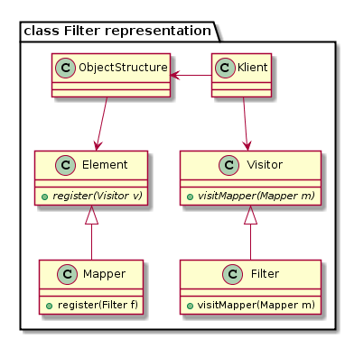
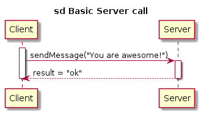

Metodika tvorby a údržby UML diagramov prostredníctvom PlantUML
===============================================================

PlantUML
--------

`PlantUML <http://plantuml.sourceforge.net/index.html>`__ je jednoduchý
program na tvorbu UML diagramov prostredníctvom ich textového opisu. K
samotnému programu prislúcha aj rozsiahla
`dokumentácia <http://plantuml.com/PlantUML_Language_Reference_Guide.pdf>`__.

PlantUML je voľne dostupný na
`stiahnutie <http://plantuml.sourceforge.net/download.html>`__ z
oficiálnej stránky, prípadne je možné na otestovanie použiť aj
jednoduchú `web aplikáciu <http://www.plantuml.com/plantuml/>`__.

Pre plnohodnotné využitie je potrebné mať taktiež nainštalovaný
`Graphviz <http://plantuml.sourceforge.net/graphvizdot%20html>`__.

Tiež ponúka možnosť
`integrácie <http://plantuml.sourceforge.net/running.html>`__ s
viacerými textovými editormi a wiki stránkami.

Pravidlá pre tvorbu súborov
---------------------------

1. Každý diagram sa nachádza v samostatnom textovom súbore (koncovka
   .txt, resp .wsd pri použití integrácie so sublime text).
2. Vygenerovaný diagram má identický názov ako prislúchajúci textový
   súbor (koncovka .png).
3. Názvy súborov sú po anglicky.

Užitočné príkazy a postupy
--------------------------

Odstránenie duplicity pomocou Preprocesoru
~~~~~~~~~~~~~~~~~~~~~~~~~~~~~~~~~~~~~~~~~~

Pri písaní diagramov, ktoré obsahujú komplikované vzťahy medzi entitami
môžeme naraziť na situáciu, kde budeme veľa krát za sebou písať ten istý
názov triedy alebo metódy. S využitím makier preprocessoru môžeme túto
duplicitu ľahko odstrániť.

::

    @startuml
    'Bez proprocesoru

    package "class Filter representation" {
        class ObjectStructure
        class Element {
            +{abstract}register(Visitor v)
        }
        class Mapper {
            +register(Filter f)
        }
        class Klient
        class Visitor {
            +{abstract}visitMapper(Mapper m)
        }
        class Filter {
            +visitMapper(Mapper m)
        }

        ObjectStructure -down-> Element
        Mapper -up-|> Element

        ObjectStructure <-left- Klient

        Klient -down-> Visitor
        Filter -up-|> Visitor
    }
    @enduml

::

    @startuml
    'S preprocesorom
    !define o(x) ObjectStructure
    !define e(x) Element
    !define m(x) Mapper
    !define k(x) Klient
    !define v(x) Visitor
    !define f(x) Filter

    package "class Filter representation" {
        class o()
        class e() {
            +{abstract}register(v(x) v)
        }
        class m() {
            +register(Filter f)
        }
        class k()
        class v() {
            +{abstract}visitMapper(m(x) m)
        }
        class f() {
            +visitMapper(m(x) m)
        }

        o() -down-> e()
        m() -up-|> e()

        o() <-left- k()

        k() -down-> v()
        f() -up-|> v()
    }
    @enduml

*V oboch prípadoch bude výsledok nasledovný:*

V druhom prípade
sa rozhodne menej napíšeme a máme možnosť meniť použité názvy tried na
jednom mieste namiesto toho aby sme ich museli meniť všade. Stojí za
poznámku, že každé definované makro musí mať parameter (v našom prípade
x, z ktorého ajtak nečítame). Viac o Preprocesore na
`tejto <http://plantuml.sourceforge.net/preprocessing.html>`__ stránke.

Použitie aliasov v sekvenčnom diagrame
~~~~~~~~~~~~~~~~~~~~~~~~~~~~~~~~~~~~~~

V sekvenčných diagramoch odporúčame pri definovaní volaní medzi
objektami používať aliasy (skratky). Ich princíp je analogický s
predchádzajúcim makrom avšak sú ešte o niečo prehladnejšie. Aliasy nie
sú však podporované v class diagrame.

::

    @startuml
    participant Client as c
    participant Server as s

    title sd Basic Server call

    activate c
        c -> s: sendMessage("You are awesome!")
        activate s
            s --> c: result = "ok"
        deactivate s
    deactivate c

    @enduml

*Výsledok:*

Užitočnosť týchto skratiek (a makier) pochopiteľne narastá s
narastajúcou komplexitou daného diagramu.

Pravidlá pre súborovú štruktúru
-------------------------------

Samotné UML diagramy je potrebné rozdeliť do prehľadnej súborovej
štruktúry:

-  projekt (názov projektu, napr. 3dsoftviz)

   -  doc (inštalačná dokumentácia, vygenerovaná dokumentácia atď.)
   -  uml

      -  structural

         -  class diagrams (korešpondujúce s reálnym kódom)
         -  component diagrams

      -  behavioral

         -  activity diagrams
         -  use-case diagrams
         -  sequence diagrams
         -  state diagrams
