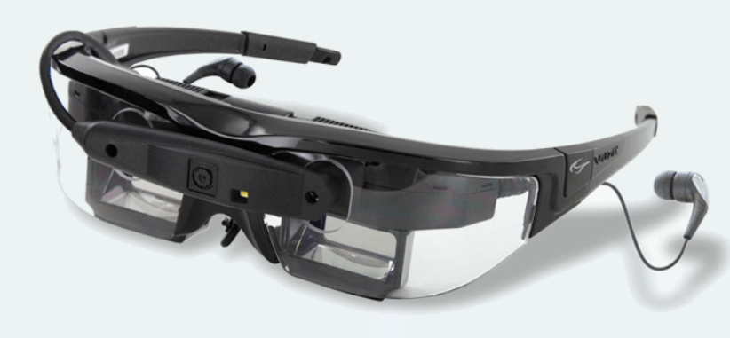
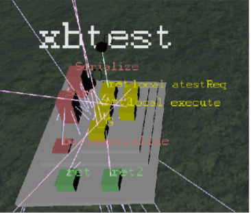

Big picture a sumarizácia features nástroja 3DSoftviz
=====================================================
Úvod
====

Motivácia
---------
Človek je v dnešnej dobe zahltený čoraz väčším množstvom informácií a je pre neho obtiažne si dané informácie zapamätať. Z nedávnych poznatkov je zrejmé, že vizualizácia informácií nám pomáha si ich ľahšie zapamätať. Je to spôsobené zapojením oboch hemisfér mozgu narozdiel od zapojenia iba ľavej hemisféry pri spracovaní informácií vo forme čísel alebo písaného textu.

Ďalším dôležitým faktom je charakter dnešných dát. Tie bývajú často multidimenzionálne, pričom pod dimenziou chápeme počet atribútov, ktoré majú jednotlivé položky datasetu. Často nás zaujímajú iba niektoré dimenzie a tie ostatné vnímame ako šum, ktorý nám sťažuje vnímanie vlastností a vzťahov v datasete. Neprehľadnosť môže byť tiež umocnená veľkosťou analyzovaných dát. V takom prípade tiež výrazne pomôže vizualizácia dát vo forme grafu. Tá nám umožní vnímať vzťahy či vzory, ktoré predtým neboli viditeľné.

Ciele
-----
3DSoftviz je už niekoľko rokov vyvíjaný softvér na Fakulte informatiky a informačných technológií STU. Na začiatku bol vytvorený s úmyslom stať sa general-purpose nástrojom na vizualizáciu informácií pomocou grafových štruktúr. Neskôr sa zameral na vizualizáciu softvéru. Napriek neskoršiemu vymedzeniu sa je ho ale po pomerne malých modifikáciách možné prispôsobiť na vizualizáciu informácii aj z iných oblastí.

Aktuálne sa využíva na vizualizáciu statických aspektov softvéru vo forme orientovaných či neorientovaých grafov. Datasety s informáciami o uzloch a hranách dokáže načítať z XML súboru, databázy či git repozitára. Okrem iného je tiež možné pridávanie uzlov či hrán, viacero možností rozmiestnenia uzlov grafu, manipulácia s grafom pomocou myši, zhlukovanie uzlov či vizualizácia evolúcie softvéru - zmien softvéru v čase zachytených v trojrozmernom priestore.

Architektúra systému 
====================

*Core –* obsahuje jadro systému, inicializuje základné časti systému.

*Data -* dátový modul pre opis štruktúry grafu, obsahujúci triedy reprezentujúce jednotlivé
prvky grafu (graph, node, edge, type, layout, ...).

*Importer -* modul pre parsovanie vstupných súborov vo formátoch GraphML, RSF a GXL.

*Layout –* modul, ktorý má na starosti rozmiestňovanie uzlov v 3D priestore, taktiež obsahuje
implementácie layout algoritmu a triedy pre pridávanie ohraničení rozmiestnenia.

*Manager -* modul pre prácu s grafom.

*Math -* model pre rozšírenie práce s kamerou.

*Model –* modul pre komunikáciu systému s databázou. Funkcionalitou je mapovanie
objektov do databázy, vytvorenie spojenia s databázou a základne funkcie výberu a uloženia
grafu. Taktiež umožňuje uloženie uzlov aj s ich atribútmi a viacero rozmiestnení pre 1 graf.

*Network -* modul pre podporu kolaboratívnej práce nad grafom. Poskytuje klient/server
funkcionalitu.

*Noise -* modul pre vytvorenie generovaného 3D priestoru pre pozadie.

*OsgBrowser -* modul zahŕňa viazanie udalostí pre jednotlivé klávesy a akcie myši medzi
rozhraniami Qt a OpenSceneGraph a vizualizáciu načítaných grafov.

*QOSG –* modul pre prácu s grafickými prvkami softvéru. Má na starosti vytvorenie hlavného
okna a prácu s pomocnými oknami a widgetami.

*Util -* zabezpečuje konfiguráciu nastavení aplikácie a funkcie pre vyčistenie pamäte.

*Viewer -* modul zabezpečuje pohyb v 3D priestore a prácu s kamerou. V module sa tiež
pripravuje graf a jeho pre zobrazenie a vytvorenie 3D kocky pre pozadie.

*Kinect –* modul pre komunikáciu a ovládanie zariadenia Kinect. Medzi jeho funkcionalitu
patrí získavanie informácií a ich nasledovné spracovanie. Obsahuje detegovanie gest, ktoré
nahrádzajú ovládanie myšou, otáčanie a pohyb grafu a gestá pre ďalšie ovládanie.

*Speech -* implementuje funkcionalitu rozpoznávania hlasu.

*OpenCV -* zabezpečuje rozpoznávanie tváre na obraze z kamery a poskytuje funkcionalitu pre
správu kamier.

*QOpenCV –* obsahuje okno pre ovládanie rozpoznávania tváre, značky a ovládanie video
pozadia.

*Aruco –* obsahuje funkcionalitu, ktorá vie rozpoznávať značky z kamery použitím knižnice
Aruco.

*5DTGloves –* zabezpečuje detegovanie gesta ruky a vykonávanie korešpondujúcich akcií.

*Leap senzor –* deteguje dve ruky používateľa v 3D priestore a sleduje pohyby rúk až na
úroveň článkov prstov.

*3D myš –* poskytuje ovládanie kamery pomocou tohto zariadenia.

Prípady použitia
================

Zobrazenie cez stereoskopické okuliare
--------------------------------------

*Zdroj: Tímový projekt č. 18 2016/2017*

Rozšírením projektu o stereoskopické 3D okuliare sme schopní vnímať
grafy načítané zo súboru alebo vytvorené analýzou volaných funkcií
skriptovacieho jazyka Lua ako trojdimenzionálne objekty. Podporované sú
nasledujúce okuliare:

-  Nvidia 3D Vision PRO - slúžia na zobrazenie scény v 3D

-  Vuzix STAR 1200XL - umožňujú zobraziť scénu s grafmi do rozšírenej
   reality

Vuzix okuliare sú zariadenie pre rozšírenú realitu. Pozostávajú z dvoch
displejov ktoré zobrazujú obraz pred očami z pripojeného počítača.
Podporujú viaceré režimy zobrazenia. V 3dSoftViz sú využívané dva 3D
režimy - jeden je top-bottom režim ktorý zobrazuje vrhnú polovicu
obrazovky počítača do pravého displeja a spodnú polovicu do ľavého
displeja; druhý je side-by-side režim, ktorý zobrazuje pravú polovicu
obrazovky počítača na pravý displej a ľavú polovicu na pravý displej.
Vhodným zobrazením stereo obrazu na počítači je docielený 3D efekt.

Pre docielenie stereoskopického efektu bolo potrebné na strane projektu
3DSoftviz zabezpečiť správne rozdelenie obrazu na polovice ktoré sú
vzájomne posunuté a tým docielime efekt stereoskopického 3D. Zobrazenie
scény v režime 3D je priamo podporované v OSG. V 3DSoftviz je upravená
*src/Viewer/PickHandler.cpp*, kde sú pridané jednotlivé 3D módy.

Okrem displejov je súčasťou kamera, ktorá sníma obraz pred
používateľom a modul ktorý sleduje aktuálnu pozíciu okuliarov v
priestore. Kameru okuliarov je možné využívať v iných moduloch
3DSoftvizu, no zatiaľ táto funkcionalita zostáva nevyužitá.

Okuliare 3D Vision využívajú quad buffer. Jedná sa o technológiu
používanú v počítačovej grafike pre implementácie stereoskopického
renderovania. Pre stereoskopické renderovanie musí každé oko získavať
samostatný obraz. Quad buffer využíva double buffering s predným a
zadným buffrom synchronizovane pre každé oko. Takto dostávame 4 buffre.
OpenSceneGraph podporuje mnohé stereoskopické režimy, medzi ktoré patrí
aj quad buffer *(osg::DisplaySettings::StereoMode::QUAD_BUFFER).*
Prepnutie na stereoskopické režim - quad buffer je spojený s už
existujúcim riešením pre AR okuliare v triede
*src/Viewer/PickHandler.cpp.*

Zobrazenie pomocou viacerých monitorov
--------------------------------------

*Zdroj: Tímový projekt č. 18 2016/2017*

Touto funkcionalitou je rozšírená prezentačná časť projektu na viacerých
monitoroch. Zobrazenie pomocou viacerých monitorov, resp. projektorov je
v projekte docielené v rozdelení viewportu na toľko ekvivalentných
častí, s koľkými monitormi/projektormi pracujeme. Následne vytvoríme
určitý počet kamier, ktoré sa budú sprá- vať ako slave kamery relatívne
od hlavnej kamery. Slave kamery sú posunuté do jedného a druhého smeru,
aby sa neprekrývali. Ilustrácia výslednej zostavy kamier je znázornená
na tomto obrázku (pre 3 kamery):

Manipulácia s grafom v priestore cez Leap senzor
------------------------------------------------

*Zdroj: Tímový projekt č. 9 2014/2015*

Táto funkcionalita 3DSoftviz umožňuje v 3D priestore manipulovať
s grafom ako alternatívne riešenie, ktoré nahradí prácu s myšou
a klávesnicou.

Leap Motion systém rozpoznáva a sleduje ruky, prsty a nástroje.
Zariadenie pracuje v detailnej blízkosti s vysokou presnosťou sledovania
počtu snímok za sekundu a zaznamenáva diskrétnu pozíciu, gestá a pohyb.
Leap Motion snímač poskytuje SDK na vývoj softvéru v jazyku C++ a je
prístupný pre platformy Windows, Linux aj Mac.

Leap Motion snímač používa optické senzory a infračervené žiarenie. Leap
snímač poskytuje sledovanie rúk, prstov a nástrojov v zornom poli ako
mnoţinu alebo rám (frame) aktualizovaných dát. Frame objekt obsahuje
zoznam sledovaných subjektov ako ruky, prsty ich gestá a pohyb v scéne.
Frame je koreň dátového modelu Leap senzora.

Objekt Hand poskytuje informácie o polohe, identite ruky a zoznam prstov
na ruke. Softvér Leap má zabudovaný interný model ľudskej ruky pre
lepšie sledovanie, aj keď ruky nie sú viditeľné. Metóda
Hand.confidence() udáva, ako dobre pozorované dáta zodpovedajú internému
modelu.

Objekt Finger poskytuje informácie o pozícií a smere, v ktorom špička
prsta ukazuje.

Rozšírená funkcionalita aplikácie vďaka zakomponovaniu Leap senzora:

-  **Ovládanie fly modu** - Ak je používateľ aplikácie v tzv. fly mode, pri
   stlačení tlačidla Start Leap (v záložke “More features”) pravou rukou
   mení smer natočenia kamery. Natočenie vystretej dlane doľava,
   doprava, hore alebo dole má za následok natočenie smeru kamery do
   zodpovedajúcej strany. Následne, ľavou rukou určuje, či sa kamera má
   pohybovať v danom smere natočenia, alebo nie. V prípade, ţe všetky
   prsty na ľavej ruke sú vystreté, kamera sa hýbe, inak stojí.

-  **Približovanie a odďaľovanie kamery** - Približovanie a odďaľovanie
   kamery sa ovláda za pomoci gesta "Circle". Ak používateľ vystretým
   prstom opíše kružnicu kamera sa oddiali alebo priblíži podľa toho, či
   kružnica bola opísaná v smere alebo proti smeru hodinových ručičiek.

-  **Pohyb grafu** - Po stlačení tlačidla Start Leap (v záložke “More
   features”) je pozícia grafu namapovaná na polohu pravej ruky. Ak
   používateľ hýbe rukou, graf sa hýbe v scéne po všetkých troch
   súradniciach na základe zmeny polohy ruky.

Uloženie a načítanie dát z databázy
-----------------------------------

*Zdroj: Tímový projekt č. 20 2009/2010*

Získané dáta z načítaného grafu je potrebné v aplikácii uchovávať. Na to
sme sa rozhodli použiť relačnú databázu, ktorá nám umožňuje relatívne
jednoducho uložiť celú grafovú štruktúru, vykonávať nad ňou základný ale
aj filtrovaný výber dát, a tieto dáta tiež uložiť medzi jednotlivými
behmi aplikácie.

Modul komunikácie s databázou predstavuje rozhranie medzi jadrom
aplikácie a databázovým úložiskom. Pomocou tohto modulu je možné do
databázy vložiť graf či jeho časti alebo ho z nej načítať. Poskytuje
tiež metódy umožňujúce vykonávať zmeny v uloženej grafovej štruktúre,
aplikovať filtre na výber dát, update atribútov, layoutu a iných dát
potrebných pre vizualizáciu a tento modul zabezpečuje časť dátovej
integrity. Umožňuje tiež získať niektoré základné štatistické údaje o
grafe (počet uzlov, počet hrán, početnosť typov hrán, atď.)

Pre potreby projektu je použitý databázový server PostgreSQL.

Ovládanie cez používateľské rozhranie
-------------------------------------

*Zdroj: Tímový projekt č. 20 2009/2010*

Aplikácia, ktorú vytvárame má v prvom rade za úlohu poskytovať prehľadnú
a pútavú 3D vizualizáciu v podobe grafu používateľovi. Aby nešlo o
strohé zobrazenie grafu v priestore, je potrebné poskytnúť používateľovi
možnosť interakcie s aplikáciou, aby si mohol prispôsobiť jej jednotlivé
aspekty vlastným potrebám, respektíve aby sa bol schopný dostať k
informáciám, ktoré potrebuje. Na tento účel naša aplikácia obsahuje 2D
grafické používateľské rozhranie či už na hlavnej obrazovke zobrazujúcej
samotný graf, alebo tvoriace rozhranie pre konfiguráciu aplikácie.

Pre tento účel sme zvolili nástroj na návrh a implementáciu grafických
rozhraní s názvom Qt. Hlavnou výhodou použitia Qt je fakt, že je
kompatibilný so širokým spektrom platforiem, takže nie je potrebné
upravovať kód samostatne pre každú z nich. Ďalším dôležitým argumentom
pre voľbu Qt pre náš projekt je jeho veľmi jednoduché a efektívne API,
umožňujúce rapídne redukovať veľkosť kódu potrebného na realizáciu
jednotlivých funkcii. Ak sme schopný minimalizovať veľkosť kódu pomôže
nám to aj znížiť čas potrebný pre úpravy tohto kódu v neskorších fázach
projektu, ak to bude potrebné.

Rozhranie vytvorené v Qt implementované v module GUI prijíma vstupy od
používateľa a tak riadi celú aplikáciu. Výstupy tohto modulu smerujú na
modul zobrazenia grafu 3D Viewer, implementovaný nad knižnicou OSG.
Samotné prepojenie týchto nástrojov a prenos informácii oboma smermi je
realizovaný prostredníctvom widgetov, vopred vytvorených mini aplikácii
v Qt uspôsobených na tento účel.

3D Vizualizovanie grafu
-----------------------

*Zdroj: Tímový projekt č. 20 2009/2010*

Vizualizáciu grafu zabezpečia scénografické prostriedky. Jedná sa o
nástroje priamo určené na tvorbu 3D grafiky, ktoré často poskytujú
nástroje, ktoré zapuzdrujú funkcionalitu grafických knižníc nižších
úrovní (ako je napríklad OpenGL). Vďaka tomu odbremeňujú programátorov
od náročných výpočtov, a tým podstatne urýchľujú vývoj aplikácií s 3D
grafikou. Tiež často využívajú pokročilé optimalizačné algoritmy, vďaka
čomu zlepšujú celkový výkon aplikácie

Na vizualizáciu dát v systéme slúži modul 3D Viewer. Samotné
vykresľovanie bude realizované pomocou knižnice Open Scene Graph, ktorá
nám poskytuje postačujúcu funkcionalitu a výkon. Zároveň poskytuje:

-  Pokročilé operácie s kamerou

-  Podporu funkcionality OpenGL

-  Širokú sadu nástrojov na tvorbu 3D grafiky

-  Podporu OpenGL Shading Language (GLSL)

Samotná vizualizácia umožňuje oddeliť rôzne druhy uzlov. Graf tiež
rozoznáva rôzne druhy prepojení. Kvôli zlepšeniu výkonu celej aplikácie
nie sú uzly reprezentované trojrozmernými objektmi . Namiesto toho sú
využité 2-rozmerné plochy, ktoré sa natáčajú smerom k používateľovi tak,
aby vždy videl ich prednú stranu (tzv. „billboarding“). Jednotlivé
reprezentácie uzlov potom sú konfigurovateľné používateľom podľa
predmetu jeho záujmu.

Tento modul zahŕňa aj prácu s používateľskými vstupmi, nakoľko knižnica
OSG poskytuje pokročilé rozhranie na ich spracovanie. Kamera je ovládaná
v kombinácii myši a klávesnice. Pomocou myši je tiež riešená interakcia
používateľa s grafom - po kliknutí na zvolený uzol nad ním je možné
vykonávať ďalšie operácie.

Zobrazenie grafu modulov cez metaforu mesta
-------------------------------------------

*Zdroj: Diplomová práca Denis IlLés 2016/2017*

Metafory pretransformujú abstraktnú problematiku softvéru do inej,
používateľovi prijateľnejšej oblasti a uľahčujú nám pochopenie
problémovej oblasti využitím inej, menej problémovej oblasti.
V 3DSoftviz je implementovaná funkcionalita na zobrazenie grafu modulov
vo forme mesta. Primárnou úlohou je poskytnúť používateľovi náhľad na
artefakty softvéru pomocou entít me sta, umožniť používateľovi
pristupovať k podrobnostiam artefaktov, umožniť mu meniť pohľad do 3D
scény a podľa potreby škálovať vizualizáciu pre zvýšenie prehľadnosti.
Pri metafore sa uzly modulov znázorňujú ako hierarchické štruktúry
poskladané z regiónov, budov a gúľ. Vytvorenie metafory mesta je možné
pre jazyky Java a Lua.

Vizualizácia Moonscript grafu
-----------------------------

*Zdroj: Diplomová práca Denis IlLés 2016/2017, Diplomová práca*
Horváth 2015/2016

3DSoftViz dokáže zobrazovať grafy projektov písaných v programovacom
jazyku Moonscript. Graf sa získava zo zdrojových súborov obsahujúcich
kód v programovacom jazyku Moonscript. Pomocou extraktoru sú
najdôležitejšie artefakty zaznamenané a vložené do grafovej
reprezentácie. Špeciálnou črtou tohto typu grafu je možnosť znázornenia
grafu tried kliknutím sa konkrétny uzol vo vizualizovanom grafe.

Zobrazenie evolúcie softvéru cez graf
-------------------------------------

*Zdroj: Diplomová práca Michael Garaj 2015/2016*

Táto funkcionalita systému 3DSoftviz umožňuje prácu s Git repozitárom a
vizualizačný nástroj na zobrazenie zmien, ktoré v ňom nastali. Poskytuje
používateľovi nový pohľad na evolúciu softvéru a niektoré javy, ktoré
pri evolúcii softvéru môžu nastať. Umožňuje sa zamerať na funkcie, ktoré
majú vysokú zložitosť, prípadne odhaliť niektoré pachy kódu ako je
napríklad dlhá metóda. Taktiež ponúka vizuálnu reprezentáciu základných
zmien ako je pridanie, modifikácia a vymazanie funkcionality.

Pre tento účel vznikla samostatná knižnica GitLib, ktorá obsahuje
potrebnú funkcionalitu na spracovanie informácií obsiahnutých v Git
repozitároch. Údaje získané pomocou tejto knižnice sa využívajú za
účelom zobrazenia evolúcie Git repozitáru. Používateľovi poskytujeme
možnosť prehrania evolúcie pomocou sekvenčnej animácie, kde je možné
regulovať rýchlosť prehrávania. Pre detailnejšiu analýzu je poskytnutá
možnosť prechádzať evolúciu po krokoch dopredu a dozadu alebo sa pomocou
posuvnej lišty presunúť na nami zvolenú verziu. Modul taktiež poskytuje
zobrazenie zmien vykonaných v súbore voči predchádzajúcej verzii.

Vizualizovanie vlastností systému prostredníctvom metrík
--------------------------------------------------------

*Zdroj: Diplomová práca František Nagy 2013/2014*

V aplikácií 3DSoftviz je možné vizualizovať softvér na základe grafu
volaní medzi funkciami skombinovaný s grafom súborovej štruktúry
projektu v jazyku Lua.

Výsledný graf je vytvorený tak, že sa najprv vytvorí strom súborovej
štruktúry začínajúci v danom adresári. Pritom sú brané do úvahy len
súbory a adresáre a sú ignorované skryté súbory. Súbory, ktoré majú
príponu ".lua" sú považované za zdrojové kódy jazyka Lua a sú ďalej
analyzované. Pre každý takýto súbor sú vytvorené vrcholy pre všetky
funkcie, ktoré sú v danom súbore definované a sú spojené hranou s
vrcholom zodpovedajúcim zdrojovému súboru. V týchto vrcholoch
reprezentujúcich funkcie sú tiež uložené informácie o metrikách.
Následne sú do grafu pridané orientované hrany pre volania funkcií
takto: ak je v tele funkcie A volaná funkcia B, tak je do grafu pridaná
hrana z vrcholu reprezentujúceho funkciu A do vrcholu reprezentujúceho
funkciu B.

Zhlukovanie grafu
-----------------

*Zdroj: Diplomová práca Andrej Britvík 2013/2014*

Zhlukovanie nachádza využitie najmä pri grafoch väčších rozmerov,
pretože sa snaží riešiť spomínaný problém nečitateľnosti, ktorý je
spôsobený množstvom zobrazovaných uzlov a hrán v grafe. Jej cieľom je
zoskupovanie podobných objektov grafu do jednej skupiny, zatiaľ čo
odlišné objekty spája do inej skupiny.

Táto funkcionalita je súčasťou vizualizačného systému 3DSoftviz a
obsahuje nasledujúce formy interakcie zhlukovania:

-  pohyb a zmena veľkostí zhlukov

-  zvýraznenie zhlukov pomocou priehľadnosti

   -  automatická priehľadnosť

   -  priehľadnosť všetkých zhlukov

   -  priehľadnosť vybraných zhlukov

-  zhluk ako obmedzovač uzlov

-  škálovanie obmedzovačov

-  zmena odpudivých síl uzlov vo vnútri zhlukov
   

   

Zobrazenie vnoreného webového prehliadača
-----------------------------------------

*Zdroj: Diplomová práca Michael Gloger 2014/2015*

Vnorený webový prehliadač je prvok používateľského rozhrania, často
používaný najmä v mobilných platformách. Plní úlohu doplnku k natívnemu
používateľskému rozhraniu a je určený na zobrazovanie webových stránok
bez priameho využitia bežných internetových prehliadačov (napríklad v
rámci iných aplikácií).

Výhoda tohoto zobrazenia je hlavne v možnosti externej konfigurácie
vzhľadu a v jeho jednoduchosti. Vďaka využitiu moderných webových
technológií sme schopní zobrazovať pre vyznačené uzly 2D grafy,
obsahujúce informácie o ich metrikách. Takéto prvky sú navyše umiestnené
priamo v 3D scéne, takže môžeme ľahko určiť ku ktorým uzlom patria.

Vnorený webový prehliadač obsahuje detailné informácie o softvérových
metrikách vyznačených uzlov. Má nasledujúce možnosti:

-  Umožniť označiť viaceré uzly, reprezentujúce funkcie

-  Zobraziť jeden vnorený webový prehliadač pre každý vybraný uzol

-  Zobraziť jeden vnorený webový prehliadač pre všetky vybrané uzly

-  Umožniť meniť mód zobrazovania

-  Umožniť filtráciu dát zobrazených vo webovom prehliadači

Integrácia Kinect-u
--------------------

Zdroj: Tímový projekt č. 18 2013/2014

K jedným z najznámejších zariadení, ktoré umožňujú ovládanie v
obohatenej realite patrí Kinect, preto v našom riešení zohráva dôležitú
úlohu. Na implementáciu sme sa na rozdiel od klasického prístupu SDK
Kinect knižníc od Windowsu rozhodli použiť open source riešenie OpenNI2
a na ňom založenú knižnicu NiTE2, ktorá je určená na prácu s
rozpoznávaním objektov ako sú ruky, kostra človeka alebo vytvorenie
hĺbkovej mapy priestoru.

Indentifikované Use-case-y pre Kinect:

-  použitie rúk na ovládanie grafu

-  hýbanie myškou

-  implementované gestá

Kinect v programe je určený na viacero funkcií ako to je znázornené vo
forme diagramu prípadu použitia na Obrázku nižšie. Medzi najvýznamnejšie
patrí použitie rúk na ovládanie grafu a hýbanie myškou, taktiež významnú
úlohu hrajú implementované gestá.

    
    Prípady použitia Kinectu v projekte

Používateľ je pomocou jednej ruky schopný ovládať myš, kde gestá ruky sú
namapované na akcie myši. Používateľ vie pomocou oboch rúk ovládať graf,
pohybovať s ním a taktiež má k dispozícií gestá na určité akcie s
grafom. 3DSoftviz rozpoznáva hlasové povely pomocou zariadenia Kinect
(Modul Kinect Speech).

3DSoftviz je schopný rozpoznať tvár používateľa pomocou modulu
FaceRecognition. Na základe rozpoznanej tváre sa vykonáva transformácia
vykresleného grafu.

Pred samotným rozpoznaním je potrebné, aby sa príslušný klasifikátor
tvárí naučil. Následne ju správne klasifikuje na základe haar-like
príznakov.

Medzi ďalšie vykonané zmeny patrí:

-  pridanie možnosti rotovať a posúvať graf

-  otáčania kamery pomocou pohybov, pozície hlavy alebo značkou

Reprezentácia vnorených grafov, obmedzovanie layoutu, doplnenie funkcií pre spájanie a rozklikávanie uzlov
-----------------------------------------------------------------------------------------------------------

Zdroj: Tímový projekt č. 18 2010/2011

Vnorený graf predstavuje graf, ktorý sa nachádza v rámci uzla grafu,
ktorý je

vnorenému grafu nadradený.

Návrh vychádza z existujúcej štruktúry, teda dátovej reprezentácie uzol,
hrana,

graf. Do týchto existujúcich prvkov, respektíve tried, sú doplnené
atribúty a metódy potrebné pre vytváranie kompozitnej dátovej štruktúry na úrovni
uzlov grafu, ktoré majú buď rodičovské uzly (nadradené), alebo obsahujú
vnorené uzly.

Pridaná možnosť určiť obmedzenie, kde v priestore sa môže nachádzať daný
uzol.

Zmeny zasahujú do modulu Layout:

-  nové triedy na definovanie a výpočet obmedzení

-  zásahy do behu layoutovacieho algoritmu (trieda FRAlgorithm)

-  zmena pozície navrhnutej obmedzovačom na pozíciu spĺňajúcu obmedzenie

-  ignorovanie uzlov s nastaveným parametrom ignored (napríklad kvôli
   pomocným

   uzlom, ktoré definujú tvar obmedzenia a nemôžu vplývať na iné uzly a
   tiež nemôžu

   byť presúvané layoutovacím algoritmom).

Do používateľského rozhrania sú pridané tlačidlá na pridanie obmedzení:

na povrch gule, do gule a do roviny. Interakcia prebieha nasledovne:

1. Používateľ vyberie uzly, ktorých pozícia má byť obmedzená.

2. Zvolí pridanie obmedzenia (tlačidlom podľa typu obmedzenia).

3. Pridajú sa pomocné uzly (do stredu výberu), ktoré definujú tvar
   obmedzenia (pre guľu 2 uzly – stred a povrch; pre rovinu 3 uzly).

4. Presúvaním pomocných uzlov používateľ definuje polohu a iné parametre
   tvaru obmedzenia.

Bola pridaná funkcionalita pre spájanie a rozdeľovanie uzlov, ktoré sa
neskôr začlenili pod záložku clustering.

    
Pribudli možnosti používateľského rozhrania pre prácu s databázou –
ukladanie a načítavanie grafov (Obr. nižšie).

Bol doplnený modul Data o pridávanie pomocných uzlov, ktoré ovplyvňujú
rozloženie multihrán (Obr. nižšie).

.. figure:: images/product-summary/multiedge-example.png
	:scale: 50%
	:alt: feature-screen.png
	:align: center 

	Zobrazenie grafu s jednou multihranou

Filtrovanie zobrazeného hypergrafu pomocou dopytovacieho jazyka, doplnenie magickej šošovky
--------------------------------------------------------------------------------------------

Zdroj: Bc. Zuzana Číková: Využitie dopytovacích jazykov a magických
šošoviek pri vizualizácii grafov (diplomová práca)

Rozšírenie projektu 3DSoftviz (vtedy 3DVisual) o 2 väčšie ucelené časti:

1. rozšírenie o možnosť filtrovať zobrazeného hypergrafu pomocou
   dopytovacieho jazyka

2. doplnenie magickej šošovky do upraveného systému. Systém, do ktorého
   bude výsledné riešenie integrované umožňuje zobrazenie grafov v 3D
   priestore a kompletná implementácia umožňuje nasledujúce
   funkcionality:

-  používateľ zadá dopyt na odfiltrovanie zobrazeného hypergrafu.

-  používateľ môže špecifikovať parametre modifikujúce zobrazenie v
   dopytovacom reťazci; (veľkosť, transparencia, farba a zobrazenie
   popisov)

-  výsledný dopytovací jazyk umožnuje modifikovať ľubovoľné prvky
   hypergrafu, ktoré sa v dopyte môžu vyskytnúť: uzly, incidencie aj
   hyperhrany.

-  pomocou dopytu možné filtrovanie lľubovoľného počtu hyperhrán

-  dopyt zadaný v existujúcom dopytovacom jazyku transformovaný na
   hypergrafovú štruktúru

-  možné lokálne filtrovať dáta pomocou magickej šošovky umiestnenej v
   strede obrazovky, ktorá zobrazuje vizualizáciu vyfiltrovaného a
   modifikovaného hypergrafu.

	Vizualizácia hypergrafu bez použitia šošovky (vľavo) a s použitím
	šošovky filtrujúcej vzťahy typu inheritance (vpravo).

Pridané boli dva ovládacie prvky:

-  Dopytovací panel - slúži na zadávanie dopytov, ktoré sú v súlade s
   pravidlami dopytovacieho jazyka definovaného v zdrojovej práci.

-  Ovládač šošovky - slúži na vypnutie/zapnutie šošovky. Pri jej vypnutí
   ostane vo vizualizačnom okne zobrazený iba pôvodný hypergraf,
   prípadne prázdna scéna, pokiaľ dopyt ešte nebol zadaný.

.. figure:: images/product-summary/magic-lens-example-2.png
	:scale: 50%
	:alt: magic-lens-example-2.png
	:align: center

	Zobrazenie tried implementujúcich tri konkrétne rozhrania.

Vizuálne uzly
-------------

Zdroj: Bc. Jakub Ukrop: Vizuálne sprístupňovanie informácií uložených v
grafoch (diplomová práca)

Vizuálny uzol je billboard v tvare obdĺžnika umiestnený v 3D priestore.
Má 3 hlavné grafické atribúty: farbu, veľkosť a obsah. Farba slúži na
odlíšenie uzlov podľa niektorého z parametrov priradeného uzlu pri na-
čítavaní zo súboru.

Otvorené uzly majú ofarbený rám, uzavreté uzly sú ofarbené celé. Ukážka
ofarbenia je na obrázku nižšie.

.. figure:: images/product-summary/visual-node-example-1.png
	:scale: 50%
	:alt: visual-node-example-1.png
	:align: center

	Všetky druhy vizuálnych uzlov: text, 3D objekt, webová stránka a
	obrázok.

Veľkosť uzla alebo skupiny uzlov je nastaviteľná manuálne používateľom.
Slúži najmä na zvýraznenie podrobností obsahu uzla.

Obsah uzla je zobrazený len vtedy, ak je uzol otvorený (tak definujeme
otvorenosť uzla). Obsah vypĺňa celý jeho rám (výnimkou sú 3D objekty) a
je vždy paralelný s rovinou premietania (billboarding).

Podporované sú 4 typy obsahu:

-  obrázok – v jednom s formátov png, jpg, gif, tiff

-  text – jednoduchý neformátovaný text

-  webová stránka – zobrazená vo webovom prehladači

-  3D objekt – vo formáte osg

Typ obsahu je možne meniť za behu aplikácie. Hrany, podobne ako uzavreté
uzly, sú zobrazené ako 2D textúry natočené ku kamere.

.. figure:: images/product-summary/visual-node-example-2.png
	:scale: 50%
	:alt: visual-node-example-2.png
	:align: center

	Graf predsokratovských filozofov a ich vzťahov.

Kolaboratívne virtuálne prostredie 
-----------------------------------

Zdroj: Bc. Ivan Pleško:

Kolaboratívne virtuálne prostredie pre vizualizáciu dát

Implementácia plne funkčného kolaboratívneho virtuálneho prostredia pre
vizualizáciu dát (diplomová práca)

Po spustení aplikácie vidia všetci používatelia prázdnu scénu s
horizontom. Po dohode sa rozhodnú, ktorý z nich bude v kolaborácii
figurovať ako server. Ostatní používatelia sa k serveru pripoja zadaním
správnej IP adresy. Graf, ktorý vidno na obrázku 5.1, bol na serverovej
inštancii načítaný zo súboru a k ostatným klientom sa preniesol pomocou
siete. Na tomto obrázku vidíme ukážku obrazovky dvoch spustených
inštancií (jedna serverová, druhá klientská). Obaja používatelia sa
pozerajú na ten istý graf, no každý z takej perspektívy, ktorá mu
vyhovuje.

.. figure:: images/product-summary/colab-example-1.png
	:scale: 50%
	:alt: colab-example-1.png
	:align: center

	Dvaja používatelia si prezerajú ten istý graf, každý z takej
	perspektívy, ktorá mu vyhovuje.

	Používateľ Server pozoruje používateľ Nick, ktorý našiel
	zaujímavú oblasť grafu a zvýraznil ju obalením do gule.
