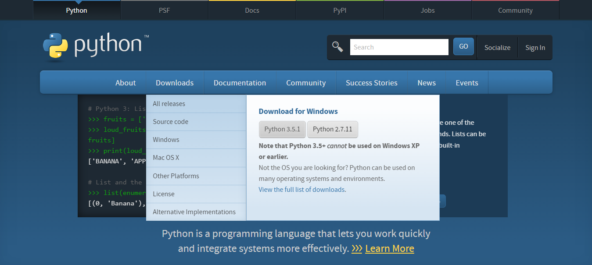

Sphinx dokumentacia
===================

Instalacia
----------

Python
~~~~~~

* Pre pracu so Sphinxom treba mat nainstalovany `Python <https://www.python.org/>`_.

.. note::

  Python ponuka verzie 2.x a 3.x. Sphinx 1.3 moze bezat pod Python 2.6, 2.7, 3.3, 3.4, ale odporucana verzia je 2.7.

* Pre stahnutie a instalovanie externych kniznic pre Python existuje prikaz *pip*. Prikaz uz sa nachadza v oficialnych verziach Pythonu 3.4.0 alebo 2.7.9.

    Ak prikaz sa nenainstaloval automaticky, treba ho stiahnut zo stranky `<https://bootstrap.pypa.io/get-pip.py>`_ a niekam ulozit. V prikazovom riadku treba prejst do adresara s *get-pip.py* a spustit nasledovny prikaz:

    ::

      python get-pip.py

Sphinx
~~~~~~

* Prejst do priecinku s dokumentaciou (tam kde index.rst sa nachadza) a pomocou prikazu pip nainstalovat Sphinx:

  ::

    pip install sphinx

  * (`sphinx-doc.org <http://www.sphinx-doc.org/en/stable/install.html>`_)

* Ak treba vytvorit novu dokumentaciu, pre nastavenie zdrojoveho adresara a vytvorenie potrebnych suborov na pracu so Sphinx treba spustit prikaz

  ::

    sphinx-quickstart

  a odpovedat na otazky. Vyberte si vsetky predvolene odpovede a po vyzve zadajte nazov, autorov a verziu projektu.

* Tymto prikazom budu vygenerovane subory *Makefile*, *make.bat* a *conf.py.in*.

   * Vsetky konfiguracie dokumentacie su v *conf.py.in*.

.. attention:: *Sphinx-quickstart* a vytvaranie tychto suborov generuju novu dokumentaciu! Ak subory *index.rst*, *Makefile*, *make.bat* a *conf.py.in* uz existovali, tak sa prepisu!

* Sphinx dokumentacia generuje vystup v roznych formatoch zo suborov .rst. Podrobnejsie o `RestructuredText <http://www.sphinx-doc.org/en/stable/rest.html>`_.

HTML dokumentacia
-----------------

* Subor *make.bat* povoli vygenerovat dokumentaciu v tom formate, ktory potrebujete

* Pre generovanie HTML dokumentacie treba v prikazovom riadku prejst do priecinku s ReST subormi a make.bat suborom a spustit prikaz

  ::

    make html

* Inak generovanie dokumentacie sa da spustit pomocou CMake v QtCreatore

PDF dokumentacia
----------------

Pre generovanie PDF dokumentacie potrebujeme najprv vytvorit Latex dokumentaciu.

.. note:: Pre pracu s Latex treba mat `TeXlive <https://www.tug.org/texlive/>`_

Prikazom

::

  make latex

vygeneruje sa Latex dokumentacia, ktora nasledne sa moze konvertovat do PDF pomocou programu `TeXstudio <http://www.texstudio.org/>`_.

.. note:: PDF dokumentacia generuje len pomocou prikazoveho riadku a externeho programu, neda sa spustat cez CMake!

PlantUML
--------

Pre pracu s PlantUML nastrojmi v Sphinx treba:

* nainstalovat `Javu <https://java.com/en/download/>`_
* pridat Javu do premennych prostredi (environment variable)
* nainstalovat `Graphviz <http://www.graphviz.org/pub/graphviz/stable/windows/>`_

  * odporucana verzia je 2.28

* pridat Graphviz do premennych

  .. image:: images/graphviz_dot.jpg

.. note:: Hodnota premennej ma byt do *dot.exe*

* pridat Graphviz do extensions v conf.py.in:
  ::

    extensions = ['sphinx.ext.graphviz']
* nainstalovat *sphinxcontrib-plantuml* zo `stranky <https://pypi.python.org/pypi/sphinxcontrib-plantuml>`_ alebo prikazom
  ::

    pip install sphinxcontrib-plantuml
* pridat pantuml do extensions v conf.py.in:
  ::

	extensions = ['sphinxcontrib.plantuml']
* stiahnut `plantuml.jar <http://plantuml.com/download.html>`_
* pridat do conf.py.in prikaz
  ::

    plantuml = 'java -jar cesta/do/plantuml.jar'

  .. attention:: Dolezite je zmenit tuto cestu na spravnu, aku mate aktualnu na Vasom pocitaci!

* pridavat UML do dokumentacii je mozne pomocou
  ::

    .. uml::

		!include /cesta/do/subor.wsd(txt)

		alebo

		@startuml
		PlantUML kod
		@enduml

Excel tabulky
-------------

* Pre import Excel suborov do dokumentacie treba nainstalovat *exceltable* pomocou prikazu

::

  pip install sphinxcontrib-exceltable

* Pridat *exceltable* do extensions v *conf.py.in*:

::

  extensions = ['sphinxcontrib.exceltable']

* Importovat tabulky pridanim do .rst suboru:

::

  .. exceltable:: caption
    :file: path/to/document.xls
    :header: 1
    :selection: A1:B2

* Podrobnejsie o `Options <https://pythonhosted.org/sphinxcontrib-exceltable/#option>`_
