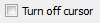
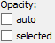
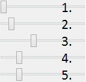

Akceptačné testovanie
=====================

Záložka GRAPH
-------------

+----------------------------------------+-----------------------------------------------+-----------+---------------------------------------------------------------+
| Zoznam ovládacích prvkov               | Opis funkcionality                            | Status    | Opis závady                                                   |
|                                        |                                               |           |                                                               |
+========================================+===============================================+===========+===============================================================+
| |1000000000000044000000184655EF87_png| | manipulácia s prvkami grafu, nič neoznačuje   | funkčné   |                                                               |
+----------------------------------------+-----------------------------------------------+-----------+---------------------------------------------------------------+
| |100000000000004400000018D5CD6FF3_png| | výber jedného prvku grafu                     | funkčné   |                                                               |
+----------------------------------------+-----------------------------------------------+-----------+---------------------------------------------------------------+
| |100000000000004400000018B2CDE863_png| | výber viacerých prvkov grafu                  | funkčné   |                                                               |
+----------------------------------------+-----------------------------------------------+-----------+---------------------------------------------------------------+
| |100000000000004400000019684B8DCF_png| | centrovanie pohľadu vzhľadom na vybraný       | funkčné   |                                                               |
|                                        | prvok grafu                                   |           |                                                               |
+----------------------------------------+-----------------------------------------------+-----------+---------------------------------------------------------------+
| |10000000000000890000004AE3E8DCFB_png| | typ výberu prvku grafu: všetko, iba uzly, iba | funkčné   |                                                               |
|                                        | hrany, klastre                                |           |                                                               |
+----------------------------------------+-----------------------------------------------+-----------+---------------------------------------------------------------+
| |10000000000000440000001877C11C86_png| | pridanie meta uzla do grafu                   | funkčné   |                                                               |
+----------------------------------------+-----------------------------------------------+-----------+---------------------------------------------------------------+
| |10000000000000440000001864F64134_png| | odstránenie vybraných meta uzlov z grafu      | nefunkčné | meta uzol sa nedá odstrániť zo scény                          |
+----------------------------------------+-----------------------------------------------+-----------+---------------------------------------------------------------+
| |100000000000004400000018BEE97164_png| | ukotvenie vybraných uzlov na aktuálnej pozícii| funkčné   |                                                               |
+----------------------------------------+-----------------------------------------------+-----------+---------------------------------------------------------------+
| |100000000000004400000018670A8433_png| | uvoľnenie ukotvených uzlov                    | funkčné   |                                                               |
+----------------------------------------+-----------------------------------------------+-----------+---------------------------------------------------------------+
| |1000000000000088000000177AD5BFE4_png| | pridanie hrany medzi dvomi vybranými uzlami   | funkčné   |                                                               |
+----------------------------------------+-----------------------------------------------+-----------+---------------------------------------------------------------+
| |10000000000000880000001723BA0C72_png| | pridanie uzla                                 | funkčné   |                                                               |
+----------------------------------------+-----------------------------------------------+-----------+---------------------------------------------------------------+
| |10000000000000890000001632A2B069_png| | odstránenie vybraných elementov (uzly alebo   | funkčné   |                                                               |
|                                        | hrany)                                        |           |                                                               |
+----------------------------------------+-----------------------------------------------+-----------+---------------------------------------------------------------+
| |10000000000000880000001888E20502_png| | výber farby pre zafarbenie uzla               | nefunkčné | nedá sa vybrať iná farba ako čierna                           |
+----------------------------------------+-----------------------------------------------+-----------+---------------------------------------------------------------+
| |100000000000008700000017C7ACB39F_png| | aplikovanie vybranej farby na vybraný uzol    | funkčné   |                                                               |
+----------------------------------------+-----------------------------------------------+-----------+---------------------------------------------------------------+
| |100000000000008800000017CE90E148_png| | aplikovanie textového označenia na vybrané    | nefunkčné | uzol sa po aplikovaní zmenší a táto akcia sa nedá vrátiť späť |
|                                        | uzly podľa textu                              |           |                                                               |
+----------------------------------------+-----------------------------------------------+-----------+---------------------------------------------------------------+
| |10000000000000880000001840A22079_png| | zapnutie/vypnutie zobrazovania popisov        | funkčné   |                                                               |
|                                        | uzlov a hrán                                  |           |                                                               |
+----------------------------------------+-----------------------------------------------+-----------+---------------------------------------------------------------+
| |10000000000000880000001866413B76_png| | spustenie animovania rozmiestňovania uzlov    | funkčné   |                                                               |
|                                        | grafu                                         |           |                                                               |
+----------------------------------------+-----------------------------------------------+-----------+---------------------------------------------------------------+
| |1000000000000088000000195BC88C75_png| | zastavenie animovania rozmiestňovania uzlov   | funkčné   |                                                               |
+----------------------------------------+-----------------------------------------------+-----------+---------------------------------------------------------------+
| |100000000000008A0000001A6E8D8B4E_png| | zmena odpudivých síl pôsobiacich medzi uzlami | funkčné   |                                                               |
+----------------------------------------+-----------------------------------------------+-----------+---------------------------------------------------------------+

Záložka CONSTRAINTS
-------------------

+----------------------------------------+----------------------------------------------------+-----------+-------------------------------------+
| Zoznam ovládacích prvkov               | Opis funkcionality                                 | Status    | Opis závady                         |
+========================================+====================================================+===========+=====================================+
| |1000000000000044000000182D96668B_png| | aplikovanie priestorového ohraničenia: povrch gule | funkčné   |                                     |
+----------------------------------------+----------------------------------------------------+-----------+-------------------------------------+
| |100000000000004200000018BF35D45D_png| | aplikovanie priestorového ohraničenia: obsah       | funkčné   |                                     |
|                                        | gule                                               |           |                                     |
+----------------------------------------+----------------------------------------------------+-----------+-------------------------------------+
| |10000000000000440000001852E1B1B5_png| | aplikovanie priestorového ohraničenia: rovina      | funkčné   |                                     |
+----------------------------------------+----------------------------------------------------+-----------+-------------------------------------+
| |100000000000004200000018784AA636_png| | aplikovanie priestorového ohraničenia:             | funkčné   |                                     |
|                                        | prienik gule a roviny                              |           |                                     |
+----------------------------------------+----------------------------------------------------+-----------+-------------------------------------+
| |1000000000000044000000181DFF8FF2_png| | aplikovanie priestorového ohraničenia:             | nefunkčné | nedá sa zmeniť priemer kružnice, po |
|                                        | kružnica                                           |           | pokuse zmeniť priemer, nefunguje    |
|                                        |                                                    |           | odstránenie ohraničenia             |
+----------------------------------------+----------------------------------------------------+-----------+-------------------------------------+
| |100000000000004200000018CB8B89FC_png| | aplikovanie priestorového ohraničenia: kužeľ       | funkčné   |                                     |
+----------------------------------------+----------------------------------------------------+-----------+-------------------------------------+
| |100000000000004400000018BE4E0D99_png| | aplikovanie priestorového ohraničenia:             | funkčné   |                                     |
|                                        | kužeľový strom                                     |           |                                     |
+----------------------------------------+----------------------------------------------------+-----------+-------------------------------------+
| |100000000000004200000018B79C9F77_png| | odstránenie vybraných priestorových                | funkčné   |                                     |
|                                        | ohraničení                                         |           |                                     |
+----------------------------------------+----------------------------------------------------+-----------+-------------------------------------+
| |100000000000008D00000015E609BD30_png| | aplikovanie priestorového ohraničenia:             | funkčné   |                                     |
|                                        | povrch valca                                       |           |                                     |
+----------------------------------------+----------------------------------------------------+-----------+-------------------------------------+
| |100000000000008D00000015853A8A1A_png| | aplikovanie priestorového ohraničenia:             | funkčné   |                                     |
|                                        | povrch kužeľa                                      |           |                                     |
+----------------------------------------+----------------------------------------------------+-----------+-------------------------------------+
| |100000000000004400000018F5649D01_png| | aplikovanie radiálneho rozmiestnenia na            | funkčné   |                                     |
|                                        | označené uzly                                      |           |                                     |
+----------------------------------------+----------------------------------------------------+-----------+-------------------------------------+
| |1000000000000042000000182A4D4919_png| | výber módu vykreslenia radiálneho                  | funkčné   |                                     |
|                                        | rozmiestnenia (drôtený, plný)                      |           |                                     |
+----------------------------------------+----------------------------------------------------+-----------+-------------------------------------+
| |100000000000008C000000189BBE6071_png| | nastavenie módu 2D/3D radiálneho                   | funkčné   |                                     |
|                                        | rozmiestnenia                                      |           |                                     |
+----------------------------------------+----------------------------------------------------+-----------+-------------------------------------+
| |100000000000008F00000088EB205EFA_png| | 1. nastavenie veľkosti rozmiestnenia               | funkčné   |                                     |
|                                        | 2. nastavenie priehľadnosti rozmiestnenia          |           |                                     |
|                                        | 3. nastavenie počtu zobrazených gúľ                |           |                                     |
|                                        | 4. nastavenie faktora zosilnenia odpudivých        |           |                                     |
|                                        |    síl v radiálnom rozmiestnení pre uzly, ktoré    |           |                                     |
|                                        |    nie sú na rovnakej vrstve                       |           |                                     |
|                                        | 5. nastavenie faktora zosilnenia odpudivých        |           |                                     |
|                                        |    síl v radiálnom rozmiestnení pre uzly, ktoré    |           |                                     |
|                                        |    sú na rovnakej vrstve                           |           |                                     |
+----------------------------------------+----------------------------------------------------+-----------+-------------------------------------+
| |10000000000000520000000F5DEEA0DC_png| | prepínač medzi normálnou a vertigo kamerou         | funkčné   |                                     |
+----------------------------------------+----------------------------------------------------+-----------+-------------------------------------+
| |10000000000000880000001733C6ADD9_png| | zvýšenie vzájomnej vzdialenosti medzi rovinami     | funkčné   |                                     |
+----------------------------------------+----------------------------------------------------+-----------+-------------------------------------+
| |100000000000008800000017471CE907_png| | zníženie vzájomnej vzdialenosti medzi rovinami     | funkčné   |                                     |
+----------------------------------------+----------------------------------------------------+-----------+-------------------------------------+
| |1000000000000088000000171E96B1AF_png| | pridanie dvoch paralelných rovín                   | funkčné   |                                     |
+----------------------------------------+----------------------------------------------------+-----------+-------------------------------------+
| |100000000000008800000017A7D548F8_png| | odobranie dvoch paralelných rovín                  | funkčné   |                                     |
+----------------------------------------+----------------------------------------------------+-----------+-------------------------------------+
| |100000000000008A00000016BC7855D7_png| | zmena násobiča odpudivých síl medzi uzlami         | nefunkčné | zmenou hodnoty sa uzly nehýbu       |
+----------------------------------------+----------------------------------------------------+-----------+-------------------------------------+
| |100000000000008800000018F6B763F7_png| | vypnutie všetkých predchádzajúcich                 | funkčné   |                                     |
|                                        | obmedzení                                          |           |                                     |
+----------------------------------------+----------------------------------------------------+-----------+-------------------------------------+

Záložka CLUSTERING
------------------

+----------------------------------------+---------------------------------------------------------------+--------------+---------------------------------------+
| Zoznam ovládacích prvkov               | Opis funkcionality                                            | Status       | Opis závady                           |
+========================================+===============================================================+==============+=======================================+
| |1000000000000044000000180B304C64_png| | zlúčenie vybraných uzlov                                      | funkčné      |                                       |
+----------------------------------------+---------------------------------------------------------------+--------------+---------------------------------------+
| |100000000000004400000018C96589BC_png| | zrušenie zlúčenia vybraných uzlov                             | funkčné      |                                       |
+----------------------------------------+---------------------------------------------------------------+--------------+---------------------------------------+
| |100000000000008A000000163484BBE0_png| | definovanie algoritmu, ktorým sa bude                         | funkčné      |                                       |
|                                        | zhlukovať graf                                                |              |                                       |
+----------------------------------------+---------------------------------------------------------------+--------------+---------------------------------------+
| |100000000000006700000016A5463953_png| | nastavenie počtu rekurzií pre vybraný                         | funkčné      |                                       |
|                                        | algoritmus                                                    |              |                                       |
+----------------------------------------+---------------------------------------------------------------+--------------+---------------------------------------+
| |10000000000000880000001757645A7E_png| | spustenie zhlukovania nad aktívnym grafom                     | funkčné      |                                       |
+----------------------------------------+---------------------------------------------------------------+--------------+---------------------------------------+
| |160317233911|                         | 1. spustenie algoritmu na zväzovanie hrán                     | funkčné      |                                       |
|                                        | 2. pozastavenie algoritmu na zväzovanie hrán                  |              |                                       |
|                                        | 3. úplne zastavenie algoritmu na zväzovanie hrán a zobrazenie |              |                                       |
|                                        |    pôvodného grafu                                            |              |                                       |
|                                        | 4. vstupné pole na zadanie konštanty, určujúcej silu akou sú  |              |                                       |
|                                        |    hrany k sebe počas zväzovacieho algoritmu priťahované      |              |                                       |
+----------------------------------------+---------------------------------------------------------------+--------------+---------------------------------------+

Po použití funkcie zhlukovania, sa odkryjú nasledujúce možnosti:

+----------------------------------------+---------------------------------------------------------------+--------------+---------------------------------------+
| Zoznam ovládacích prvkov               | Opis funkcionality                                            | Status       | Opis závady                           |
+========================================+===============================================================+==============+=======================================+
| |100000000000003E00000031AFCE8E36_png| | auto - automatická priehľadnosť - mení sa na                  | funkčné      |                                       |
|                                        | základe vzdialenosti zhlukov od kamery                        |              |                                       |
|                                        |                                                               |              |                                       |
|                                        | selected - priehľadnosť označeného zhluku                     |              |                                       |
+----------------------------------------+---------------------------------------------------------------+--------------+---------------------------------------+
| |10000000000000900000001DB1EF6F8A_png| | pomocou posuvníka sa mení priehľadnosť len označených zhlukov | funkčné      |                                       |
+----------------------------------------+---------------------------------------------------------------+--------------+---------------------------------------+
| |100000000000008E000000470C14C2FC_png| | posúvaním sa mení prahová hodnota, pri                        | funkčné      |                                       |
|                                        | ktorej sa menia tvary zhlukov - spodné číslo                  |              |                                       |
|                                        | udáva, koľko uzlov obsahuje daný zhluk                        |              |                                       |
+----------------------------------------+---------------------------------------------------------------+--------------+---------------------------------------+

Pri označení konkrétneho zhluku sa odkryjú nasledujúce možnosti:

+----------------------------------------+---------------------------------------------------------------+--------------+---------------------------------------+
| Zoznam ovládacích prvkov               | Opis funkcionality                                            | Status       | Opis závady                           |
+========================================+===============================================================+==============+=======================================+
| |100000000000008800000017D9BD7C96_png| | kliknutím zmeníme označený zhluk na                           | nefunkčné    | pri pokuse o otestovanie program      |
|                                        | obmedzovač                                                    |              | spadne                                |
+----------------------------------------+---------------------------------------------------------------+--------------+---------------------------------------+
| |10000000000000880000001702681B5B_png| | znovurozmiestnenie uzlov v priestore po tom,                  | neotestované | nie je možné otestovať kvôli problému |
|                                        | ako sa nalepia na hranu – obmedzovača                         |              | s Restrict                            |
+----------------------------------------+---------------------------------------------------------------+--------------+---------------------------------------+
| |100000000000008A00000022C0AD7A66_png| | upravenie odpudivej sily medzi uzlami v                       | neotestované | nie je možné otestovať kvôli problému |
|                                        | označenom zhluku - čím je hodnota väčšia,                     |              | s Restrict                            |
|                                        | tým budú uzly ďalej od seba                                   |              |                                       |
+----------------------------------------+---------------------------------------------------------------+--------------+---------------------------------------+

Záložka CONNECTIONS
-------------------

+----------------------------------------+-----------------------------------------------------------+---------+-------------+
| Zoznam ovládacích prvkov               | Opis funkcionality                                        | Status  | Opis závady |
+========================================+===========================================================+=========+=============+
| |100000000000008A00000022787850BE_png| | meno, pod ktorým bude používateľ vystupovať v kolaborácii | funkčné |             |
+----------------------------------------+-----------------------------------------------------------+---------+-------------+
| |100000000000008800000017419C7E57_png| | spustenie/zastavenie servera                              | funkčné |             |
+----------------------------------------+-----------------------------------------------------------+---------+-------------+
| |100000000000008A000000220A716225_png| | IP adresa servera                                         | funkčné |             |
+----------------------------------------+-----------------------------------------------------------+---------+-------------+
| |100000000000008800000017EFA4E2A5_png| | pripojenie(odpojenie) ku(od) kolaborácii                  | funkčné |             |
+----------------------------------------+-----------------------------------------------------------+---------+-------------+
| |100000000000008C00000046A4D57BEB_png| | zoznam používateľov                                       | funkčné |             |
+----------------------------------------+-----------------------------------------------------------+---------+-------------+
| |100000000000003600000036926EBFDC_png| | Spy - získa používateľ pohľad iného používateľa           | funkčné |             |
|                                        |                                                           |         |             |
|                                        | Center - nasmeruje pohľad používateľa tak,                |         |             |
|                                        | aby v jeho strede bol iný používateľ                      |         |             |
|                                        |                                                           |         |             |
|                                        | Shout - iným používateľom sa v scéne zobrazí              |         |             |
|                                        | pri vašom mene ikona znázorňujúca, že sa                  |         |             |
|                                        | pokúšate upútať pozornosť                                 |         |             |
+----------------------------------------+-----------------------------------------------------------+---------+-------------+
| |10000000000000890000002BADD2CCC3_png| | nastavenie veľkosti avatarov v scéne                      | funkčné |             |
+----------------------------------------+-----------------------------------------------------------+---------+-------------+

Záložka MORE FEATURES
---------------------

+----------------------------------------+-----------------------------------------------+--------------+---------------------------------+
| Zoznam ovládacích prvkov               | Opis funkcionality                            | Status       | Opis závady                     |
+========================================+===============================================+==============+=================================+
| |100002010000006600000011B4DE8DC1_png| | ak je zaškrtnuté, kamera nasmerovaná          | funkčné      |                                 |
|                                        | a graf sa pohybuje na základe pohybu          |              |                                 |
|                                        | tváre, značky alebo rúk, inak sa na           |              |                                 |
|                                        | základe týchto akcií rotuje samotný graf      |              |                                 |
+----------------------------------------+-----------------------------------------------+--------------+---------------------------------+
| |100002010000006700000012BDB07758_png| | povoľuje použitie kamery                      | funkčné      |                                 |
+----------------------------------------+-----------------------------------------------+--------------+---------------------------------+
| |100000000000008800000017AA0AED20_png| | otvorenie okna pre prácu s kamerou            | funkčné      |                                 |
+----------------------------------------+-----------------------------------------------+--------------+---------------------------------+
| |1000000000000088000000170254F076_png| | otvorenie okna pre prácu s hlasovým ovládaním | neotestované | Speech je momentálne vylúčený z |
|                                        |                                               |              | projektu                        |
+----------------------------------------+-----------------------------------------------+--------------+---------------------------------+
| |100000000000008800000017413B8E7C_png| | zapnutie ovládania pomocou Leap Senzoru       | funkčné      |                                 |
+----------------------------------------+-----------------------------------------------+--------------+---------------------------------+

Možnosti okna otvoreného po kliknutí na vyššie uvedené tlačidlá:

+----------------------------------------+------------------------------------------------+--------------+----------------------------+
| Zoznam ovládacích prvkov               | Opis funkcionality                             | Status       | Opis závady                |
+========================================+================================================+==============+============================+
| |100000000000006B00000042C3F83F22_png| | prispôsobenie l’avej strany okna pre           | funkčné      | treba pri zapinani         |
|                                        | ovládanie funkcionality rozpoznávania tváre    |              | zaskrtnut Camera rotation  |
|                                        |                                                |              | a Camera enabled           |
+----------------------------------------+------------------------------------------------+--------------+----------------------------+
| |1000000000000065000000173A10D902_png| | zvolenie kamerového zariadenia a následným     | funkčné      |                            |
|                                        | potvrdením objavenie záberu z kamery s         |              |                            |
|                                        | rozpoznávaním tváre (graf sa pohybuje na       |              |                            |
|                                        | základe pohybu tváre)                          |              |                            |
+----------------------------------------+------------------------------------------------+--------------+----------------------------+
| |100000000000007000000041B635012D_png| | prispôsobenie l’avej strany okna pre ovládanie | funkčné      |                            |
|                                        | funkcionality rozpoznávania značky             |              |                            |
+----------------------------------------+------------------------------------------------+--------------+----------------------------+
| |10000000000000650000001796A2AF29_png| | zvolenie kamerového zariadenia a následným     | funkčné      |                            |
|                                        | potvrdením objavenie záberu z kamery           |              |                            |
|                                        | určenej pre rozpoznávanie značky a graf sa     |              |                            |
|                                        | začne otáčať a pohybovať so značkou            |              |                            |
+----------------------------------------+------------------------------------------------+--------------+----------------------------+
| |100000000000004F0000000FEC4CF6B8_png| | nastavenie aktuálne snímanie ako pozadie       | funkčné      |                            |
|                                        | pre graf                                       |              |                            |
+----------------------------------------+------------------------------------------------+--------------+----------------------------+
| |10000201000000630000002915638961_png| | prepínanie medzi pohybom podľa značky ako      | neotestované | nepodarilo sa vykonať test |
|                                        | keby sa kamera pozerala na používateľa a       |              |                            |
|                                        | naopak                                         |              |                            |
+----------------------------------------+------------------------------------------------+--------------+----------------------------+
| |100000000000006500000017979E34AC_png| | nastavenie korekčných parametrov               | neotestované | nepodarilo sa vykonať test |
+----------------------------------------+------------------------------------------------+--------------+----------------------------+
| |1000000000000065000000177C91CF62_png| | zmena spôsobu použitia značky v prípade, že    | funkčné      |                            |
|                                        | používateľ má k dispozícii len jednu značku    |              |                            |
+----------------------------------------+------------------------------------------------+--------------+----------------------------+
| |100000000000003D0000000F5820E584_png| | vypnutie/zapnutie zobrazenia videa             | funkčné      |                            |
+----------------------------------------+------------------------------------------------+--------------+----------------------------+
| |1000000000000088000000179195620E_png| | zapnutie detekcie Kinectom                     | funkčné      |                            |
+----------------------------------------+------------------------------------------------+--------------+----------------------------+
| |100000000000005E00000017B1B1298F_png| | zachytenie kádra s následnou možnosťou dať     | neotestované | nepodarilo sa vykonať test |
|                                        | ho na pozadie                                  |              |                            |
+----------------------------------------+------------------------------------------------+--------------+----------------------------+
| |100000000000005E0000000F773D7D28_png| | prepínanie medzi detekovaním ruky pre          | funkčné      |                            |
|                                        | manipuláciu grafu alebo kamery v podobe        |              |                            |
|                                        | rotovania a medzi detekovaním ruky pre         |              |                            |
|                                        | funkciu “klik” (pohyb ruky do hĺbky, nie       |              |                            |
|                                        | vertikálne alebo horizontálne)                 |              |                            |
+----------------------------------------+------------------------------------------------+--------------+----------------------------+
| |10000000000000580000000F1A585785_png| | vypnutie možnosti približovania                | funkčné      |                            |
+----------------------------------------+------------------------------------------------+--------------+----------------------------+
| |100000000000004700000029E932FAEF_png| | nastavenie práce s arucom (manipulácia grafu   | funkčné      |                            |
|                                        | pomocou značiek)                               |              |                            |
+----------------------------------------+------------------------------------------------+--------------+----------------------------+

Hlavné okno
-----------

+----------------------------------------+-----------------------------------------------+--------------+-----------------------------------------------------+
| Zoznam ovládacích prvkov               | Opis funkcionality                            | Status       | Opis závady                                         |
+========================================+===============================================+==============+=====================================================+
| |100000000000006B00000016E3D0F655_png| | filtrovanie hrán                              | funkčné      | nefunguje na operačnom systéme Windows              |
+----------------------------------------+-----------------------------------------------+--------------+-----------------------------------------------------+
| |100000000000007F00000016BB966294_png| | filtrovanie uzlov                             | funkčné      | nefunguje na operačnom systéme Windows              |
+----------------------------------------+-----------------------------------------------+--------------+-----------------------------------------------------+
| |10000000000000AD00000017929650C3_png| | zobrazí dialóg pre výber súborov; po vybratí  | funkčné      | nefunguje na operačnom systéme Windows              |
|                                        | vykreslí do poľa pod tlačidlom graf volaní    |              |                                                     |
|                                        | funkcií týchto súborov                        |              |                                                     |
+----------------------------------------+-----------------------------------------------+--------------+-----------------------------------------------------+
| |10000201000000AD00000018AD24406D_png| | prepínanie medzi zobrazovaním jedného         | funkčné      | nefunguje na operačnom systéme Windows              |
|                                        | prehliadača pre každý uzol a zobrazovaním     |              |                                                     |
|                                        | jedného prehliadača pre všetky vyznačené uzly |              |                                                     |
+----------------------------------------+-----------------------------------------------+--------------+-----------------------------------------------------+
| File – načítanie grafu zo súboru       | načítanie grafu do scény                      | funkčné      |                                                     |
+----------------------------------------+-----------------------------------------------+--------------+-----------------------------------------------------+
| File - načítanie grafu z databázy      | načítanie grafu do scény                      | neotestované | nie sú k dispozícii grafy v databázovej podobe      |
+----------------------------------------+-----------------------------------------------+--------------+-----------------------------------------------------+
| File - uloženie grafu                  | uloží graf                                    | neotestované | možnosť bola implementovaná pre databázové riešenie |
+----------------------------------------+-----------------------------------------------+--------------+-----------------------------------------------------+
| File - uloženie layout                 | ponúkne možnosť nazvať layout a uloži ho      | neotestované | možnosť bola implementovaná pre databázové riešenie |
+----------------------------------------+-----------------------------------------------+--------------+-----------------------------------------------------+
| File - ukončenie aplikácie             | ukončí aplikáciu                              | funkčné      |                                                     |
+----------------------------------------+-----------------------------------------------+--------------+-----------------------------------------------------+
| Settings                               | nastavenia jednotlivých parametrov aplikácie  | funkčné      |                                                     |
+----------------------------------------+-----------------------------------------------+--------------+-----------------------------------------------------+

.. |160317233911| image:: images/160317233911.png

.. |10000201000000AD00000018AD24406D_png| image:: images/10000201000000AD00000018AD24406D.png

.. |10000000000000AD00000017929650C3_png| image:: images/10000000000000AD00000017929650C3.png

.. |100000000000006B00000016E3D0F655_png| image:: images/100000000000006B00000016E3D0F655.png

.. |10000201000000630000002915638961_png| image:: images/10000201000000630000002915638961.png

.. |100000000000006500000017979E34AC_png| image:: images/100000000000006500000017979E34AC.png

.. |100000000000004F0000000FEC4CF6B8_png| image:: images/100000000000004F0000000FEC4CF6B8.png

.. |100000000000004700000029E932FAEF_png| image:: images/100000000000004700000029E932FAEF.png

.. |100000000000003D0000000F5820E584_png| image:: images/100000000000003D0000000F5820E584.png

.. |10000000000000650000001796A2AF29_png| image:: images/10000000000000650000001796A2AF29.png

.. |100000000000003B0000002D6D824B16_png| image:: images/100000000000003B0000002D6D824B16.png

.. |1000000000000065000000177C91CF62_png| image:: images/1000000000000065000000177C91CF62.png

.. |10000000000000580000000F1A585785_png| image:: images/10000000000000580000000F1A585785.png

.. |100000000000006B00000042C3F83F22_png| image:: images/100000000000006B00000042C3F83F22.png

.. |100000000000008800000017413B8E7C_png| image:: images/100000000000008800000017413B8E7C.png

.. |100000000000008800000017AA0AED20_png| image:: images/100000000000008800000017AA0AED20.png

.. |1000000000000088000000170254F076_png| image:: images/1000000000000088000000170254F076.png

.. |100002010000006700000012BDB07758_png| image:: images/100002010000006700000012BDB07758.png

.. |100002010000006600000011B4DE8DC1_png| image:: images/100002010000006600000011B4DE8DC1.png

.. |1000000000000088000000179195620E_png| image:: images/1000000000000088000000179195620E.png

.. |100000000000008800000017419C7E57_png| image:: images/100000000000008800000017419C7E57.png

.. |100000000000008A000000220A716225_png| image:: images/100000000000008A000000220A716225.png

.. |10000000000000890000002BADD2CCC3_png| image:: images/10000000000000890000002BADD2CCC3.png

.. |100000000000003600000036926EBFDC_png| image:: images/100000000000003600000036926EBFDC.png

.. |100000000000008C00000046A4D57BEB_png| image:: images/100000000000008C00000046A4D57BEB.png

.. |10000000000000880000001702681B5B_png| image:: images/10000000000000880000001702681B5B.png

.. |1000000000000044000000180B304C64_png| image:: images/1000000000000044000000180B304C64.png

.. |10000000000000880000001757645A7E_png| image:: images/10000000000000880000001757645A7E.png

.. |100000000000008E000000470C14C2FC_png| image:: images/100000000000008E000000470C14C2FC.png

.. |100000000000008A00000022C0AD7A66_png| image:: images/100000000000008A00000022C0AD7A66.png

.. |100000000000006700000016A5463953_png| image:: images/100000000000006700000016A5463953.png

.. |100000000000004400000018C96589BC_png| image:: images/100000000000004400000018C96589BC.png

.. |10000000000000900000001DB1EF6F8A_png| image:: images/10000000000000900000001DB1EF6F8A.png

.. |100000000000008A000000163484BBE0_png| image:: images/100000000000008A000000163484BBE0.png

.. |100000000000008800000017D9BD7C96_png| image:: images/100000000000008800000017D9BD7C96.png

.. |1000000000000042000000182A4D4919_png| image:: images/1000000000000042000000182A4D4919.png

.. |100000000000004400000018BE4E0D99_png| image:: images/100000000000004400000018BE4E0D99.png

.. |100000000000004400000018F5649D01_png| image:: images/100000000000004400000018F5649D01.png

.. |100000000000008D00000015E609BD30_png| image:: images/100000000000008D00000015E609BD30.png

.. |1000000000000088000000171E96B1AF_png| image:: images/1000000000000088000000171E96B1AF.png

.. |100000000000008A00000016BC7855D7_png| image:: images/100000000000008A00000016BC7855D7.png

.. |1000000000000044000000182D96668B_png| image:: images/1000000000000044000000182D96668B.png

.. |100000000000004200000018B79C9F77_png| image:: images/100000000000004200000018B79C9F77.png

.. |100000000000008C000000189BBE6071_png| image:: images/100000000000008C000000189BBE6071.png

.. |100000000000004200000018784AA636_png| image:: images/100000000000004200000018784AA636.png

.. |100000000000008800000017A7D548F8_png| image:: images/100000000000008800000017A7D548F8.png

.. |100000000000004200000018CB8B89FC_png| image:: images/100000000000004200000018CB8B89FC.png

.. |100000000000008800000017471CE907_png| image:: images/100000000000008800000017471CE907.png

.. |100000000000004200000018BF35D45D_png| image:: images/100000000000004200000018BF35D45D.png

.. |100000000000008D00000015853A8A1A_png| image:: images/100000000000008D00000015853A8A1A.png

.. |10000000000000880000001733C6ADD9_png| image:: images/10000000000000880000001733C6ADD9.png

.. |10000000000000520000000F5DEEA0DC_png| image:: images/10000000000000520000000F5DEEA0DC.png

.. |1000000000000044000000181DFF8FF2_png| image:: images/1000000000000044000000181DFF8FF2.png

.. |100000000000004400000018670A8433_png| image:: images/100000000000004400000018670A8433.png

.. |10000000000000890000001632A2B069_png| image:: images/10000000000000890000001632A2B069.png

.. |10000000000000890000004AE3E8DCFB_png| image:: images/10000000000000890000004AE3E8DCFB.png

.. |10000000000000440000001877C11C86_png| image:: images/10000000000000440000001877C11C86.png

.. |100000000000004400000019684B8DCF_png| image:: images/100000000000004400000019684B8DCF.png

.. |100000000000008800000017CE90E148_png| image:: images/100000000000008800000017CE90E148.png

.. |10000000000000880000001866413B76_png| image:: images/10000000000000880000001866413B76.png

.. |1000000000000044000000184655EF87_png| image:: images/1000000000000044000000184655EF87.png

.. |10000000000000880000001888E20502_png| image:: images/10000000000000880000001888E20502.png

.. |100000000000008700000017C7ACB39F_png| image:: images/100000000000008700000017C7ACB39F.png

.. |10000000000000880000001840A22079_png| image:: images/10000000000000880000001840A22079.png

.. |100000000000004400000018D5CD6FF3_png| image:: images/100000000000004400000018D5CD6FF3.png

.. |100000000000008A0000001A6E8D8B4E_png| image:: images/100000000000008A0000001A6E8D8B4E.png

