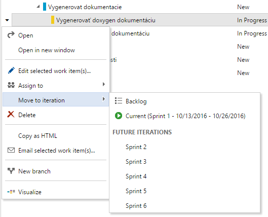
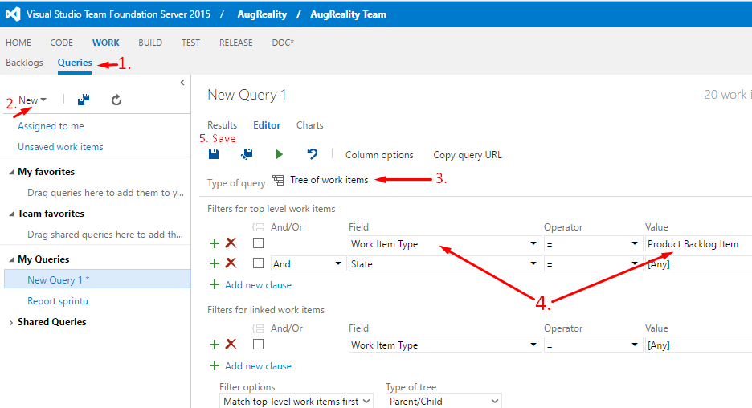
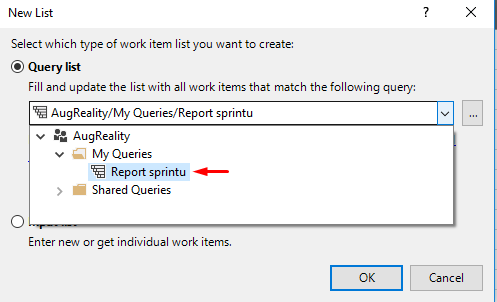

TFS metodika
============

Všeobecná metodika na manažment úloh v tíme
-------------------------------------------
Pridanie novej úlohy
~~~~~~~~~~~~~~~~~~~~

* Pri každej úlohe je potrebné uviesť opis. Opis si k úlohe zadáva ten, kto si ju vyberie.
* Uviesť odhadovaný čas dokončenia.
* Opis musí byť podrobný, aby každému členovi bolo jasné, čo ma vykonať po pridelení úlohy.

Rozdeľovanie úloh
~~~~~~~~~~~~~~~~~

* Každý si vyberie (potiahne) úlohu/úlohy, ktorá/é majú najvyššiu prioritu.
* Ak ostanú nepridelené úlohy, študentský vedúci tímu pridelí členom zvyšné úlohy.

Kedy je úloha hotová
~~~~~~~~~~~~~~~~~~~~

* Dokumentácia: Keď je  znovu vygenerovaná.
* Kód: Potrebné spraviť code review a vykonať pull request do vetvy, ktorá sa bude mergovať.
* Testy: Keď je spravený report z testu.
* Zápisnica: Keď je nahratá vo formáte pdf na stránke tímu.

TFS metodika
------------
* Adresa TFS: https://tfs.fiit.stuba.sk:8443/tfs/  (Potrebné sa lognúť 2x)
* Projekt: Just18

Pridávanie úloh
~~~~~~~~~~~~~~~

* Úlohy podobného charakteru priradíme do spoločného backlog itemu.
* Pri pridávaní úlohy sa automaticky nastaví stav ‘To Do’.
* V prípade objavenia chyby, je potrebné vytvoriť novú úlohu typu Bug (Chyba)
* Odhadovaný čas dávame na backlog itemy, rovnako ako aj Acceptance Criteria (predpripravený field pri rozkliknutí backlog itemu v TFS).
* POZOR: TFS podporuje estimáciu času v IBA v hodinách.

Úlohy (tasky) sa môžu nachádzať v troch stavoch:
* To Do
* In Progress
* Done
Nesplnené úlohy, ktoré sa nestihli dokončiť v danom šprinte, presunieme do nasledujúceho šprintu.

Vytváranie exportov z TFS
~~~~~~~~~~~~~~~~~~~~~~~~~

Navod na stranke: https://msdn.microsoft.com/en-us/library/dd286627(v=vs.110).aspx

URL: https://tfs.fiit.stuba.sk:8443/tfs/

Login: ako do AIS-u

Pred prvým exportom je potrebné si vytvoriť query, ktoré vráti stav úloh v danom šprinte.
Návod na vytvorenie quory:

Excel
~~~~~

* V hlavnom menu vybrať záložku TEAM (mala by byť vpravo hore).
* Klik na New List ( umiestnená na ľavo pod záložkou File/Súbor).
* Vybrať novo vytvorené query:

* Hotovo
