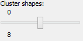
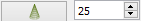

Používateľská príručka pre 3D Softviz
=====================================

**Okno s aplikáciou je rozdelené na tri základné časti:**

*   menu

	*    File – načítanie grafu zo súboru, z databázy, uloženie grafu, uloženie layoutu, ukončenie aplikácie
	*    Settings – nastavenia aplikácie; konfiguračný súbor používa bodkovú notáciu, ktorá umožňuje identifikovať význam konfiguračnej premennej
	*    Help
	*    Test - pušťa základné grafy pre rýchle testovanie (100-uzlový, 500-uzlový, Veolia, Lua Graph, Module Graph)

*   hlavné okno - zobrazuje graf a umožňuje s ním používateľovi interagovať
*   ovládací panel – nástroje pre prácu s grafom

Ovládacie prvky
---------------

**Ovládanie kamery:**

*	Vyber prvkov grafu - ľavé tlačidlo myši + pohyb myšou
*	Otáčanie kamery okolo grafu - pravé tlačidlo myši + pohyb myšou
*	Ovládanie priblíženia obrazovky - koliesko na myši
*	Ovládanie pomocou klávesnici:

	*	Hore - PgUp
	*	Dole - PgDn
	*	Vľavo - šípka vľavo
	*	Vpravo - šípka vpravo
	*	Dopredu - šípka hore
	*	Dozadu - šípka dole

Inicializácia automatického pohybu začne po stlačení kláves Alt + Shift a kliknutím myši na zvolenú hranu, či uzol. V závislosti od nastavenia aplikácie sú pred inicializovaním pohybu ešte automaticky vybrané body záujmu. Pokiaľ je automatický výber uzlov vypnutý, body záujmu je možné zvoliť manuálne myšou alebo stlačením klávesy Q (pre náhodný výber uzlov alebo pre výber uzlov pomocou metrík). Automatické použitie metrík je možné vypnúť v nastavení aplikácie pomocou parametra „Viewer.PickHandler.SelectInterestPoints“ nastaveného na hodnotu 1.

**Iné ovládacie prvky:**

* Kláves "T" – skrytie všetkých ovládacích prvkov
* Kláves "S" - štatistiky vykresľovania
* Kláves "Shift" - pridávanie ďalších objektov do výberu
* Kláves "Ctrl" - odstránenie objektov z výberu

Záložka GRAPH
-------------

|1000000000000044000000184655EF87_png|
- manipulácia s prvkami grafu (no-select mód), pohyb vybraných uzlov v priestore

|

|100000000000004400000018D5CD6FF3_png|
- výber jedného prvku grafu (single-select mód)

Umožňuje sústredenie sa na práve jeden objekt – môže to byt’ hrana aj uzol.

|

|100000000000004400000018B2CDE863_png|
- výber viacerých prvkov grafu (multi-select mód)

Umožňuje vybrať v trojrozmernom zobrazení viacero objektov naraz.

|

|10000000000000890000004AE3E8DCFB_png|
- typ výberu: všetko, iba uzly, iba hrany, klastre

|

|100000000000004400000019684B8DCF_png|
- centrovanie pohľadu vzhľadom na vybraný prvok grafu

V prípade, že nie je označený žiadny element, kamera bude vycentrovaná na ťažisko grafu

|

|10000000000000440000001877C11C86_png|
- pridanie meta uzla do grafu

|

|10000000000000440000001864F64134_png|
- odstránenie vybraných meta uzlov z grafu

|

|100000000000004400000018BEE97164_png|
- ukotvenie vybraných uzlov na aktuálnej pozícii, t. j. nebudú sa pohybovať v závislosti od pôsobenia síl ostatných uzlov

|

|100000000000004400000018670A8433_png|
- uvoľnenie ukotvených uzlov

|

|1000000000000088000000177AD5BFE4_png|
- pridanie hrany medzi dvomi vybranými uzlami

Umožňuje pridať hranu medzi dvoma vybranými uzlami, kde ešte nie je hrana, inak končí akcia chybovou hláškou. Ideálne je čiernou šípkou vybrať jeden uzol a bielou šípkou ho nastaviť na také miesto, kde sa ho dá spojiť s druhým uzlom - je potrebné mať nastavenie Node v takomto prípade spolu s Multi-select mode.

|

|10000000000000880000001723BA0C72_png|
- pridanie uzla do stredu pohľadu

|

|10000000000000890000001632A2B069_png|
- odstránenie vybraných elementov (uzly alebo hrany)

Ak sa rozhodneme pre zmazanie hrany, uzly prepojené s touto hranou v grafe zostávajú.

|

|10000000000000880000001888E20502_png|
,
|100000000000008700000017C7ACB39F_png|
- zafarbenie zvolených uzlov a hrán farbou vybranou z palety nad tlačidlom

|

|100000000000008800000017CE90E148_png|
- aplikovanie textového označenia na vybrané uzly podľa textu z poľa nad tlačidlom

|

|10000000000000880000001840A22079_png|
- zapnutie/vypnutie zobrazovania popisov uzlov a hrán

|

|10000000000000880000001866413B76_png|
,
|1000000000000088000000195BC88C75_png|
- spustenie/zastavenie rozmiestňovania (animovania) uzlov grafu

|

|100000000000008A0000001A6E8D8B4E_png|
- zmena odpudivých síl pôsobiacich medzi uzlami

|

|160317232855|
- výber vizuálnej reprezentácie uzla (square, sphere) a výber vizuálnej reprezentácie hrany (quad, cylinder, line)

|

|dragger-scale_png|
- pridanie nového manipulátora (geometria kocky) do scény, ktorý umožňuje pohyb kamery ľavým tlačidlom myši

|

|dragger-rotation_png|
- pridanie nového manipulátora (geometria gule) do scény, ktorý umožňuje rotáciu grafu okolo jeho stredu ľavým tlačidlom myši

|

|city-layout_png|
- reprezentácia grafu ako vizualizačnej metafory mesta (namiesto klasického grafu).

Záložka CONSTRAINTS
-------------------

|1000000000000044000000182D96668B_png|
– aplikovanie priestorového ohraničenia: povrch gule

|

|100000000000004200000018BF35D45D_png|
- aplikovanie priestorového ohraničenia: obsah gule

|

|10000000000000440000001852E1B1B5_png|
- aplikovanie priestorového ohraničenia: rovina

|

|100000000000004200000018784AA636_png|
- aplikovanie priestorového ohraničenia: zjednotenie gule a roviny

Zjednotenie gule a roviny je vhodné pre zobrazenie grafov s hustým stredom, alebo na veľké grafy.

|

|1000000000000044000000181DFF8FF2_png|
- aplikovanie priestorového ohraničenia: kružnica

Aplikovanie obmedzenia na kružnicu na uzly v celom grafe je vhodné pre veľmi riedke grafy alebo na grafy s pravidelnou štruktúrou. Pri hustých grafoch sa hrany medzi uzlami prekrývajú

|

|100000000000004200000018CB8B89FC_png|
- aplikovanie priestorového ohraničenia: kužeľ

Obmedzenie na kužeľ je vhodným riešením v prípadoch, kedy má jeden uzol výrazne vyšší počet hrán ako ostatné uzly.

|

|100000000000004400000018BE4E0D99_png|
- aplikovanie priestorového ohraničenia: kužeľový strom

Po aplikácií sa uzly rozdelia do skupín podľa spoločného rodiča. Na tieto skupiny sa aplikujú obmedzenia na kužeľ, ktoré sú následne obmedzené na roviny v závislosti od hĺbky uzlov v strome. Kužeľový strom sa aplikuje automaticky na celý graf na základe používateľom vybraného koreňového uzla. Jedine v prípade, že graf nie je spojitý, tak sa aplikuje iba na komponent, ktorý obsahuje koreňový uzol.

|

|100000000000004200000018B79C9F77_png|
- odstránenie vybraných priestorových ohraničení

|

|100000000000008D00000015E609BD30_png|
- aplikovanie priestorového ohraničenia: povrch valca

Vloží do scény tzv. bod záujmu, od ktorého sú uzly zobrazovaného grafu odtláčané do tvaru valca. Polomer valca sa dá nastaviť pomocou číselníka.

|

|100000000000008D00000015853A8A1A_png|
- aplikovanie priestorového ohraničenia: povrch kužeľa

Vloží do scény tzv. bod záujmu, od ktorého sú uzly zobrazovaného grafu odtláčané do tvaru kužeľa. Polomer kužeľa sa dá nastaviť pomocou číselníka. Veľkosť kužeľa sa nastavuje automaticky podľa toho, kam sa používateľ prostredníctvom kamery pozerá.

|

|100000000000004400000018F5649D01_png|
- aplikovanie radiálneho rozmiestnenia na označené uzly

Odporúča sa používať pri stromovom type grafu. Použitie rozmiestnenia na označené uzly dáva používateľovi nové možnosti ako zväčšenie priestoru označením uzlom, alebo manuálne zhlukovanie uzlov.

|

|1000000000000042000000182A4D4919_png|
- výber módu vykreslenia radiálneho rozmiestnenia (drôtený, plný)

|

|100000000000008C000000189BBE6071_png|
- nastavenie módu 2D/3D radiálneho rozmiestnenia

|

|100000000000008F00000088EB205EFA_png|

1. nastavenie veľkosti rozmiestnenia
2. nastavenie priehľadnosti rozmiestnenia
3. nastavenie počtu zobrazených gúľ
4. nastavenie faktora zosilnenia odpudivých síl v radiálnom rozmiestnení pre uzly, ktoré nie sú na rovnakej vrstve
5. nastavenie faktora zosilnenia odpudivých síl v radiálnom rozmiestnení pre uzly, ktoré sú na rovnakej vrstve

Veľkosť radiálneho zobrazenia sa dá nastaviť v rozmedzí 0 – 300, parameter priesvitnosti 0 - 100 %, veľkosť faktora zosilnenia odpudivých síl sa nastavuje medzi hodnotami 1 - 5000.

|

|10000000000000520000000F5DEEA0DC_png|
- prepínač medzi normálnou a vertigo kamerou

Tento mód kamery je vhodné použiť vtedy, keď chce používateľ meniť dva rôzne pohľady na graf: lokálny pohľad, pri ktorom môže používateľ s väčšou presnosťou skúmať jednotlivé uzly a vzťahy medzi nimi a globálny pohľad, pri ktorom môže používateľ skúmať vzťahy medzi uzlami a rozloženie uzlov v daných hĺbkach kostry grafu v globálnom kontexte.

|

|10000000000000880000001733C6ADD9_png|
- zvýšenie vzájomnej vzdialenosti medzi rovinami

|

|100000000000008800000017471CE907_png|
- zníženie vzájomnej vzdialenosti medzi rovinami

|

|1000000000000088000000171E96B1AF_png|
- pridanie dvoch paralelných rovín

Obmedzenie na roviny sa aplikuje pri grafoch s minimálnou maximálnou hĺbkou kostry grafu hodnoty 2. Koreňový uzol v kostre grafu určí program - vyberie uzol s najväčším počtom hrán. Pri zrušení obmedzenia sa uzly „odpoja“ od roviny.

|

|100000000000008800000017A7D548F8_png|
- odobranie dvoch paralelných rovín

|

|100000000000008A00000016BC7855D7_png|
- zmena násobiča odpudivých síl medzi uzlami

Násobič odpudivých síl medzi uzlami je na začiatku nastavený na 1 kvôli prvému pridaniu dvoch rovín do priestoru - nechceme, aby sa hneď zväčšili odpudivé sily.

|

|100000000000008800000018F6B763F7_png|
- vypnutie všetkých predchádzajúcich obmedzení

Záložka CLUSTERING
------------------

|1000000000000044000000180B304C64_png|
- zlúčenie vybraných uzlov

Umožňuje zlúčiť vybrané uzly do jedného spoločného uzla. Takýto uzol sa bude v pokračovaní zobrazovať modrou farbou.

|

|100000000000004400000018C96589BC_png|
- zrušenie zlúčenia vybraných uzlov

|

|100000000000008A000000163484BBE0_png|
- definovanie algoritmu, ktorým sa bude zhlukovať graf (adjacency, leafs, neighbours)

|

|100000000000006700000016A5463953_png|
- nastavenie počtu rekurzií pre vybraný algoritmus

|

|10000000000000880000001757645A7E_png|
- spustenie zhlukovania nad aktívnym grafom

Ak zhlukovanie trvá viac ako 1 sekundu, objaví sa indikátor postupu.

|

|160317233911|

1. spustenie algoritmu na zväzovanie hrán
2. pozastavenie algoritmu na zväzovanie hrán
3. úplne zastavenie algoritmu na zväzovanie hrán a zobrazenie pôvodného grafu
4. vstupné pole na zadanie konštanty, určujúcej silu akou sú hrany k sebe počas zväzovacieho algoritmu priťahované

**Po použití funkcie zhlukovania, sa odkryjú nasledujúce možnosti:**

|100000000000003E00000031AFCE8E36_png|
auto  - automatická priehľadnosť - mení sa na základe vzdialenosti zhlukov od kamery

selected - priehľadnosť označeného zhluku – pomocou posuvníka(nižšie) sa mení priehľadnosť len označených zhlukov

|

|10000000000000900000001DB1EF6F8A_png|
- posúvaním upravíme priehľadnosť označených zhlukov

|

|100000000000008E000000470C14C2FC_png|
- posúvaním sa mení prahová hodnota, pri ktorej sa menia tvary zhlukov

Spodné číslo udáva, koľko uzlov obsahuje daný zhluk (v tomto prípade 8).

|

**Pri označení konkrétneho zhluku sa odkryjú nasledujúce možnosti:**

|100000000000008800000017D9BD7C96_png|
- kliknutím zmeníme označený zhluk na obmedzovač

Obmedzuje pozície uzlov tak, aby z neho nevyšli von. Keď obmedzovač posunieme dostatočne ďaleko, t.j. mimo pôvodnej pozície uzlov, uzly sa začnú lepiť na jeho stenu a posúvať spolu s ním. Ignoruje príťažlivé a odpudivé sily medzi ním a ostatnými uzlami grafu (posunutie zhluku bez obmedzovača spôsobí posun celého grafu za týmto zhlukom). Obmedzovač začína svoje pôsobenie ako kocka, je možné zmeniť jeho tvar naťahovaním a stlačením.

|

|10000000000000880000001702681B5B_png|
- znovurozmiestnenie uzlov v priestore po tom, ako sa nalepia na hranu obmedzovača

|

|100000000000008A00000022C0AD7A66_png|
- upravenie odpudivej sily medzi uzlami v označenom zhluku

Čím je hodnota väčšia, tým budú uzly ďalej od seba.

|

**Ďalšie funkcie obmedzovača:**

Ak na zhluk zaregistrujeme obmedzovač, môžeme s ním jednoducho pohybovať a meniť jeho tvar pomocou klávesových skratiek a myši:

*   Pohyb – metóda ťahaj a pusť (    drag & drop    )
*   Zmena veľkosti – držíme **Ctrl** a točíme kolieskom myši
*   Zmena tvaru

    *   na osy x – držíme        **X**        a        **Ctrl**        a točíme kolieskom myši
    *   na osy y – držíme	**Y**        a        **Ctrl**        a točíme kolieskom myši
    *   na osy z – držíme        **Z**        a        **Ctrl**        a točíme kolieskom myši

Záložka CONNECTIONS
-------------------

|100000000000008A00000022787850BE_png|
- napísanie mena, pod ktorým bude používateľ vystupovať v kolaborácii

|

|100000000000008800000017419C7E57_png|
- spustenie/zastavenie servera

|

|100000000000008A000000220A716225_png|
- napísanie IP adresy servera

|

|100000000000008800000017EFA4E2A5_png|
- pripojenie(odpojenie) ku(od) kolaborácii

|

|100000000000008C00000046A4D57BEB_png|
- zoznam používateľov (zoradený abecedne), v ktorom je možné jedného vybrať a použiť nasledujúce funkcie:

|

|100000000000003600000036926EBFDC_png|
- po výbere si môžeme zvoliť jednu funkciu z dvojice: *Spy* (špehovať) a *Center* (centrovať).

Po aktivovaní funkcie Spy získa používateľ pohľad iného používateľa, ktorý je priebežne aktualizovaný – znamená to, že pohybom sledovaného používateľa sa aktualizuje aj pohľad sledujúceho. Po aktivácii Center nasmeruje pohľad používateľa tak, aby v jeho strede bol iný používateľ. Pri centrovaní platí to isté, čo pri špehovaní – teda pri aktualizácii polohy centrovaného používateľa sa natáča aj pohľad centrujúceho používateľa. Po označení políčka Shout sa ostatným používateľom v scéne zobrazí pri vašom mene ikona znázorňujúca, že sa pokúšate upútať pozornosť.

|

|10000000000000890000002BADD2CCC3_png|
- nastavenie veľkosti avatarov v scéne

Avatar je kužeľ, ktorého kruhová podstava znázorňuje smer, ktorým sa používateľ pozerá.

|

Záložka EVOLUTION
-----------------

|EvolutionTab|
- Po rozkliknutí tabu Evolution (1) sa zobrazia možnosti evolúcie

  2. Lifespan - možnosť ponechania vymazaných uzlov vo vizualizácii. Prednastavená hodnota 0 znamená, že vymazané uzly sa automaticky vymažú z grafu. V prípade hodnoty väčšej ako 0 vymazané uzly v grafe zotrvávajú o verzie dlhšie podľa nastavenej hodnoty
  3. Change commits - prepínač spracovania Git repozitáru. Ak je zaškrtnutý, inicializuje sa spracovanie na úroveň grafu volaní. V opačnom prípade - na úroveň histórie Git repozitáru
  4. Kombo box s výberom vizualizácie - prepínanie sa medzi jednotlivými možnosťami vizualizácie grafu volaní
	  * *LuaStat* - vizualizácia softvérových metrík pomocou analýzy Lua zdrojového kódu
	  * *Difference* - pohľad na zmeny, ktorými softvér prešiel pri prechode na novú verziu
	  * *Changes* - aktivovanie filtrovania nad práve aktívnou vizualizáciou

  5. Kombo box s výberom filtra - výber vhodnej skupiny filtra
	  * Prednastavená možnosť *All* - všetky prvky grafu sú zobrazené
	  * *Authors* - filtrovanie podľa autorov zmien v softvéri
	  * *Structure* - filtrovanie podľa štruktúry

  6. Kombo box zoznamu možností - moznosti zavisia od vybraneho filtru
	  * zoznam autorov s možnosťou zobrazenia zmien všetkých autorov - *All*
	  * štruktúra - *Files* (zobrazí v grafe volaní len uzly reprezentujúce adresáre a súbory), *Local Functions* (zobrazí rozšírenú možnosť Files spolu s uzlami lokálnych funkcií), *Global Functions* (zobrazia sa uzly možnosti Local Functions spolu s uzlami globálnych funkcií) a *Modules* (zobrazí všetky štruktúry, ktoré sa v grafe nachádzajú)

|

|AnimMenu|
- panel ovládania evolúcie

1. Prechod na predchádzajúcu verziu - možnosť, kedy sa stav grafu vráti o jednu verziu dozadu
2. Prechod na nasledujúcu verziu - možnosť, kedy sa stav grafu posunie o jednu verziu dopredu
3. Tlačidlo informácií o verzii - zobrazí informácie o aktuálne zobrazenej verzii. Medzi zobrazené informácie patrí identifikátor, autor a dátum commitu spolu so zoznamom súborov, ktoré boli zmenené
4. Sputenie/zastavenie animácie - aktivovanie/zastavenie automatického prechodu na novú verziu
5. Posuvník - presun na konkrétnu verziu pomocou skokového prechodu medzi verziami
6. Indikátor verzie - poskytuje informáciu o aktuálne zobrazenej verzii
7. Spomalenie animácie - regulovanie rýchlosti animácie
8. Zrýchlenie animácie - regulovanie rýchlosti animácie

|

Záložka MORE FEATURES
---------------------

|btn_360|
- zapnutie 3D myšky (musí byť aktivovaný driver)

|160317235006|
- ak je zaškrtnuté, kamera nasmerovaná na graf sa pohybuje na základe pohybu tváre, značky alebo rúk, inak sa na základe týchto akcií rotuje samotný graf

|

|160317235033|
- povoľuje použitie kamery

|

|100000000000008800000017AA0AED20_png|
- otvorenie okna pre prácu s kamerou

|

|1000000000000088000000170254F076_png|
- otvorenie okna pre prácu s hlasovým ovládaním

	.. note:: Speech je momentálne vylúčený z projektu

|100000000000008800000017413B8E7C_png|
- zapnutie ovládania pomocou Leap Senzor–u

|

**Okno pre prácu s kamerou**

|100000000000006B00000042C3F83F22_png|
- prispôsobenie ľavej strany okna pre ovládanie funkcionality rozpoznávania tváre (pri zapínaní treba zaškrtnúť Camera rotation a Camera enabled).

|

|1000000000000065000000173A10D902_png|
- zvolenie kamerového zariadenia a následným potvrdením objavenie záberu z kamery

Ukončiť túto akciu je možné tlačidlom „StopFaceRec“ (ak používateľ zatvoril okno, môže ho vrátiť na grafický interface opätovným kliknutím na „StartCamera“ a potom pozastaviť detekciu). V prípade detegovanej tváre (detekcia je reprezentovaná zeleným obdĺžnikom) sa kamera alebo graf pohybuje vďaka pohybu tváre.

|

|160518190503|
- okno pre výber snímacieho zariadenia

|

|100000000000007000000041B635012D_png|
- prispôsobenie ľavej strany okna pre ovládanie funkcionality rozpoznávania značky

|

|10000000000000650000001796A2AF29_png|
- zvolenie kamerového zariadenia a následným potvrdením objavenie záberu z kamery určenej pre rozpoznávanie značky a graf sa začne otáčať a pohybovať so značkou

|

|100000000000004F0000000FEC4CF6B8_png|
- nastavenie aktuálne snímanie ako pozadie pre graf

Je potrebné zmeniť parameter „Viewer.SkyBox.Noise“ v konfiguračnom súbore na hodnotu 2 alebo 3 (odporúčané je 3).

|

|10000201000000630000002915638961_png|
- prepínanie medzi pohybom podľa značky ako keby sa kamera pozerala na používateľa a naopak

|

|160321173407|
- zapnutie korekcie

|

|100000000000006500000017979E34AC_png|
- nastavenie korekčných parametrov

Podľa predvolených nastavení sa značka pohybuje tak, ako keby sa kamera pozerala vo vodorovnom smere. Ak by sa pozerala napr. na stôl pod miernym sklonom dole, graf by sa pri posúvaní značky po stole neposúval korektne. Preto je možné nastaviť korekčné parametre. Najskôr je potrebné nastaviť značku do polohy, kedy je detegovaná na spodnom okraji a následne stačiť toto tlačidlo. Po nastavení sa aktivuje opcia „Correction“ (uvedené vyššie), ktorou je možné zapnúť korekciu.

|

|1000000000000065000000177C91CF62_png|
- zmena spôsobu použitia značky v prípade, že používateľ má k dispozícii len jednu značku

|

|100000000000003D0000000F5820E584_png|
- vypnutie/zapnutie zobrazenia videa

Toto prepínanie a vypnutie zobrazenia video má vplyv len na zobrazenie v rámci tohto ovládacieho okna „Face Recognition“ and „Marker Detection“ a neovplyvňuje to ani voľbu kamery pre video pozadie.

|

|160518190900|
- Interakcia s vizualizáciou v obohatenej realite

	* Možnosť *Custom light*, vyznačená modrou, ktorá slúži na prepínanie vlastného a základného zdroja svetla
	* Možnosť *Shadow*, vyznačená žltou, ktorá slúži na zapínanie a vypínanie generovania tieňov
	* Možnosť *Base*, vyznačená červenou, ktorá slúži na zobrazenie a skrytie základne
	* Možnosť *Axes*, vyznačená ružovou, ktorá slúži na zobrazenie a skrytie pomocných osí
	* Tlačidlo *Center graph*, vyznačené svetlo modrou, ktoré slúži na umietnetie grafu nad stred základne

**Okno pre prácu s kinectom a arucom**

|1000000000000088000000179195620E_png|
- zapnutie detekcie

|

|100000000000005E00000017B1B1298F_png|
- zachytenie kádra s následnou možnosťou dať ho na pozadie

|

|160321171923|
- zapnutie rozpoznávania značiek

|

|100000000000005E0000000F773D7D28_png|
- prepínanie medzi detekovaním ruky pre manipuláciu grafu alebo kamery v podobe rotovania a medzi detekovaním ruky pre funkciu “klik” (pohyb ruky do hĺbky, nie vertikálne alebo horizontálne)

|

|10000000000000580000000F1A585785_png|
- vypne možnosť približovania

|

|100000000000004700000029E932FAEF_png|
- nastavenie práce s arucom

|

|160518144428|
- zobrazenie okna projekčného zobrazenia

|

|160518144843|
- v projekcnom zobrazeni - Projector - spinboxy na zmenu parametrov projektora (odhora) - zorné pole, pozícia (súradnice x, y, z), smer projekcie(súradnice x, y, z)

|

|160518145110|
- v projekcnom zobrazeni - Viewer - spinboxy na zmenu parametrov pozorovateľa (odhora) - zorné pole, pozícia (súradnice x, y, z), smer projekcie (súradnice x, y, z)

|

|160518145709|
- v projekcnom zobrazeni - Graph - spinboxy na zmenu parametrov grafu (odhora) - pozícia (súradnice x, y, z), polomer, checkbox Place graph na potvrdenie použitia parametrov grafu (štandartne označený)

|

|160518145922|
- potvrdenie zadaných parametrov scény

**Hlasové príkazy pre Speech**

	*   select all nodes - vybratie všetkých uzlov
	*   select left side - vybratie uzlov na ľavej strany
	*   select right side - vybratie uzlov na pravej strany
	*   clear screen - zrušenie vybratia uzlov
	*   sphere - sformovanie gule pre vybrané uzly
	*   unset restrictions - návrat k pôvodnému stavu - zrušenie akcie "sphere"

Hlavné okno
-----------

|100000000000006B00000016E3D0F655_png|
- filtrovanie hrán

|

|100000000000007F00000016BB966294_png|
- filtrovanie uzlov

|

Príklady príkazov:

 * “params.type like ’file’ or params.type like ’directory’”
 * “params.name like ’init%.lua’ and params.type like ’function’”
 * “params.type like ’function’”

Filter je navrhnutý pre grafovú vizualizáciu softvéru s využitím softvérových metrík jazyka Lua a je vyhodnotený po stlačení klávesu „Enter“.

|10000000000000AD00000017929650C3_png|
- zobrazí dialóg pre výber súborov a po vybratí vykreslí do poľa pod tlačidlom graf volaní funkcií týchto súborov

Pri označení práve jedného vrcholu v poli sa zobrazí stromová štruktúra informácií o tomto vrchole.

|

|10000201000000AD00000018AD24406D|
- prepínanie medzi zobrazovaním jedného prehliadača pre každý uzol a zobrazovaním jedného prehliadača pre všetky vyznačené uzly

|

Git repozitár
-------------

|Options|
  1. Settings / Options - zobrazenie dialógového okna s konfiguráciou
  2. Možnosť Git - zobrazia sa možnosti konfigurácie spracovania Git repozitáru
  3. Možnosti konfigurácie spracovania Git repozitáru

	* vyčlenenie adresárov (ExcludeDirectories) - ľubovoľný počet názvov adresárov oddelených znakom ",". Pre zadanú hodnotu sa pri spracovaní Git repozitáru odignorujú všetky súbory, ktoré vo svojej relatívnej ceste obsahujú adresár spec.
	* ExtensionFilter - funguje obrátene, pričom ponecháva len tie súbory, ktorých koncovka súboru sa zhoduje s jednou zo zadaných hodnôt. Hodnota taktiež môže obsahovať viacero koncoviek súborov, pričom musia byť oddelené znakom ","

.. |Options| image:: images/Options.PNG

.. |EvolutionTab| image:: images/EvolutionTab.png

.. |160518145110| image:: images/160518145110.png

.. |160518145709| image:: images/160518145709.png

.. |160518145922| image:: images/160518145922.png

.. |10000000000000880000001702681B5B_png| image:: images/10000000000000880000001702681B5B.png

.. |160317235006| image:: images/160317235006.png

.. |160321171923| image:: images/160321171923.png

.. |160518144843| image:: images/160518144843.png

.. |1000000000000088000000171E96B1AF_png| image:: images/1000000000000088000000171E96B1AF.png

.. |10000000000000520000000F5DEEA0DC_png| image:: images/10000000000000520000000F5DEEA0DC.png

.. |100000000000004200000018B79C9F77_png| image:: images/100000000000004200000018B79C9F77.png

.. |10000000000000880000001866413B76_png| image:: images/10000000000000880000001866413B76.png

.. |100000000000008800000017A7D548F8_png| image:: images/100000000000008800000017A7D548F8.png

.. |100000000000005E00000017B1B1298F_png| image:: images/100000000000005E00000017B1B1298F.png

.. |100000000000008800000017419C7E57_png| image:: images/100000000000008800000017419C7E57.png

.. |100000000000004200000018BF35D45D_png| image:: images/100000000000004200000018BF35D45D.png

.. |100000000000008A00000022C0AD7A66_png| image:: images/100000000000008A00000022C0AD7A66.png

.. |100000000000004200000018CB8B89FC_png| image:: images/100000000000004200000018CB8B89FC.png

.. |100000000000008A0000001A6E8D8B4E_png| image:: images/100000000000008A0000001A6E8D8B4E.png

.. |100000000000008A00000022787850BE_png| image:: images/100000000000008A00000022787850BE.png

.. |10000000000000880000001723BA0C72_png| image:: images/10000000000000880000001723BA0C72.png

.. |100000000000007000000041B635012D_png| image:: images/100000000000007000000041B635012D.png

.. |100000000000008F00000088EB205EFA_png| image:: images/100000000000008F00000088EB205EFA.png
    :width: 1.4874in
    :height: 1.4154in

.. |1000000000000044000000180B304C64_png| image:: images/1000000000000044000000180B304C64.png

.. |10000000000000440000001877C11C86_png| image:: images/10000000000000440000001877C11C86.png

.. |10000201000000630000002915638961_png| image:: images/10000201000000630000002915638961.png

.. |100000000000003E00000031AFCE8E36_png| image:: images/100000000000003E00000031AFCE8E36.png

.. |100000000000008800000017CE90E148_png| image:: images/100000000000008800000017CE90E148.png

.. |1000000000000065000000177C91CF62_png| image:: images/1000000000000065000000177C91CF62.png

.. |100000000000006B00000042C3F83F22_png| image:: images/100000000000006B00000042C3F83F22.png

.. |100000000000004400000018670A8433_png| image:: images/100000000000004400000018670A8433.png

.. |100000000000006F0000004A7D9DFA6E_png| image:: images/100000000000006F0000004A7D9DFA6E.png

.. |10000000000000440000001864F64134_png| image:: images/10000000000000440000001864F64134.png

.. |100000000000008800000017EFA4E2A5_png| image:: images/100000000000008800000017EFA4E2A5.png

.. |100000000000004400000018B2CDE863_png| image:: images/100000000000004400000018B2CDE863.png

.. |10000000000000880000001840A22079_png| image:: images/10000000000000880000001840A22079.png

.. |1000000000000088000000177AD5BFE4_png| image:: images/1000000000000088000000177AD5BFE4.png

.. |100000000000008800000017D9BD7C96_png| image:: images/100000000000008800000017D9BD7C96.png

.. |10000000000000580000000F1A585785_png| image:: images/10000000000000580000000F1A585785.png

.. |100000000000008800000017471CE907_png| image:: images/100000000000008800000017471CE907.png

.. |100000000000004400000018BEE97164_png| image:: images/100000000000004400000018BEE97164.png

.. |1000000000000042000000182A4D4919_png| image:: images/1000000000000042000000182A4D4919.png

.. |10000000000000890000004AE3E8DCFB_png| image:: images/10000000000000890000004AE3E8DCFB.png

.. |1000000000000088000000170254F076_png| image:: images/1000000000000088000000170254F076.png

.. |100000000000004400000019684B8DCF_png| image:: images/100000000000004400000019684B8DCF.png

.. |1000000000000065000000173A10D902_png| image:: images/1000000000000065000000173A10D902.png

.. |100000000000006700000016A5463953_png| image:: images/100000000000006700000016A5463953.png

.. |100000000000004200000018784AA636_png| image:: images/100000000000004200000018784AA636.png

.. |100000000000004400000018C96589BC_png| image:: images/100000000000004400000018C96589BC.png

.. |100000000000004F0000000FEC4CF6B8_png| image:: images/100000000000004F0000000FEC4CF6B8.png

.. |10000000000000900000001DB1EF6F8A_png| image:: images/10000000000000900000001DB1EF6F8A.png

.. |100000000000006500000017979E34AC_png| image:: images/100000000000006500000017979E34AC.png

.. |10000000000000650000001796A2AF29_png| image:: images/10000000000000650000001796A2AF29.png

.. |10000000000000890000002BADD2CCC3_png| image:: images/10000000000000890000002BADD2CCC3.png

.. |1000000000000044000000181DFF8FF2_png| image:: images/1000000000000044000000181DFF8FF2.png

.. |100000000000003D0000000F5820E584_png| image:: images/100000000000003D0000000F5820E584.png

.. |10000000000000AD00000017929650C3_png| image:: images/10000000000000AD00000017929650C3.png
    :width: 1.8024in
    :height: 0.2398in

.. |100000000000008800000017413B8E7C_png| image:: images/100000000000008800000017413B8E7C.png
    :width: 1.4169in
    :height: 0.2398in

.. |100000000000008800000018F6B763F7_png| image:: images/100000000000008800000018F6B763F7.png

.. |100000000000004700000029E932FAEF_png| image:: images/100000000000004700000029E932FAEF.png
    :width: 0.7398in
    :height: 0.4276in

.. |10000000000000880000001757645A7E_png| image:: images/10000000000000880000001757645A7E.png

.. |100000000000008700000017C7ACB39F_png| image:: images/100000000000008700000017C7ACB39F.png

.. |1000000000000044000000182D96668B_png| image:: images/1000000000000044000000182D96668B.png

.. |100000000000008C000000189BBE6071_png| image:: images/100000000000008C000000189BBE6071.png

.. |100000000000005E0000000F773D7D28_png| image:: images/100000000000005E0000000F773D7D28.png

.. |1000000000000044000000184655EF87_png| image:: images/1000000000000044000000184655EF87.png

.. |10000000000000440000001852E1B1B5_png| image:: images/10000000000000440000001852E1B1B5.png

.. |1000000000000088000000195BC88C75_png| image:: images/1000000000000088000000195BC88C75.png

.. |100000000000008C00000046A4D57BEB_png| image:: images/100000000000008C00000046A4D57BEB.png

.. |100000000000004400000018D5CD6FF3_png| image:: images/100000000000004400000018D5CD6FF3.png

.. |10000000000000880000001733C6ADD9_png| image:: images/10000000000000880000001733C6ADD9.png

.. |100000000000007F00000016BB966294_png| image:: images/100000000000007F00000016BB966294.png
    :width: 1.3232in
    :height: 0.2295in

.. |160317232855| image:: images/160317232855.png

.. |160317233911| image:: images/160317233911.png

.. |10000201000000AD00000018AD24406D| image:: images/10000201000000AD00000018AD24406D.png

.. |160317235033| image:: images/160317235033.png

.. |dragger-scale_png| image:: images/dragger-scale.png
	:width: 1.3232in
	:height: 0.2295in

.. |city-layout_png| image:: images/city-layout.png
	:width: 2in
	:height: 0.1295in
