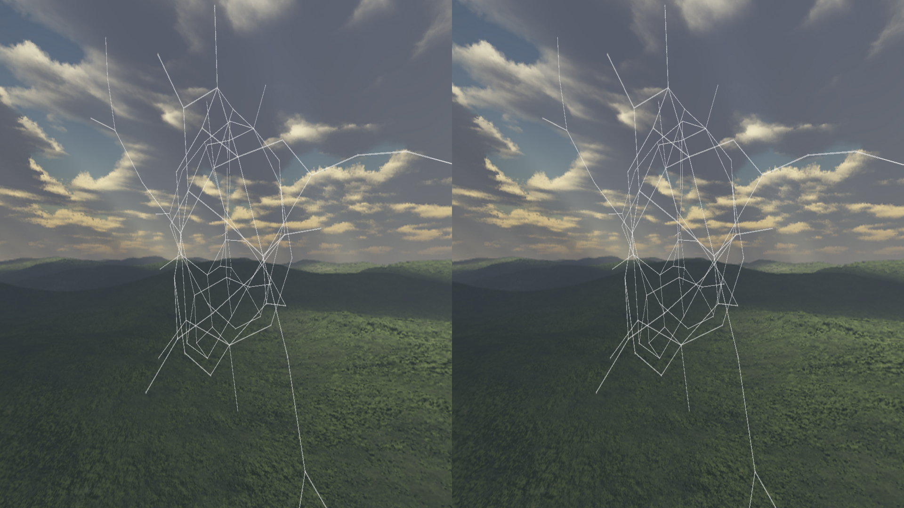

Používateľská príručka pre Vuzix a Leap 
=======================================

Stereoskopické 3D s Vuzix okuliarmi
-----------------------------------

Okuliare
~~~~~~~~

Ako prvé je potrebné pripojiť Vuzix okuliare k počítaču (HDMI a 2x USB)

Okuliare by mali byť rozpoznané ako zobrazovacie zariadenie, pre ktoré nastavte duplikáciu obrazu z monitora, na ktorom beží 3Dsoftviz.

Nakoniec pomocou ovládacieho zariadenia vyvolajte menu a nastavte režim zobrazovania obrazu na side-by-side 3D alebo top-bottom 3D, poprípade upravte aj jas a kontrast obrazu.

(menu sa zobrazí len priamo na displejoch okuliarov)

3Dsoftviz
~~~~~~~~~

Pre správne zobrazenie je potrebné nastaviť 3Dsoftviz do režimu plnej obrazovky stlačením klávesy L a skryť panel s nástrojmi stlačením klávesy T

Následne je možné pomocou klávesy G prepínať medzi režimami:

*   normálne zobrazenie
*   top-bottom 3D zobrazenie
*   side-by-side 3D zobrazenie

Vyberte zobrazenie korešpondujúce s nastavením okuliarov.

Klávesami H a J je možné upravovať nastavenie vzdialenosti očí, ktorá mení posun medzi obrazmi ktorým sa dosahuje 3D efekt.
Úprava je po 0.01m a aktuálna hodnota sa zobrazuje v konzole.

|Vuzix|

	
	
Ovládanie rukami s Leap senzorom
--------------------------------

Leap:
~~~~~

Ako prvé je potrebné pripojiť Leap senzor k počítaču (1x USB).
Ďalej je potrebné nainštalovať oficiálny softvér k Leap senzoru z oficiálnej stránky.

3Dsoftviz:
~~~~~~~~~~

V ľavej lište s nástrojmi je v karte *More features* možnosť *Start Leap*, po stlačení ktorej začne snímanie rúk nad senzorom.

Podporované je nasledovné ovládanie:

  * Ľavá ruka s vystretými prstami – pohyb kamery dopredu
  * Ľavá ruka so skrčenými prstami – zastavenie pohybu kamery
  * Pravá ruka s vystretými prstami – kamera sa otáča podľa naklonenia dlane

Snímanie je možné zastaviť opätovným stlačením rovnakého tlačidla ktoré ma počas snímania text *Stop Leap*.
